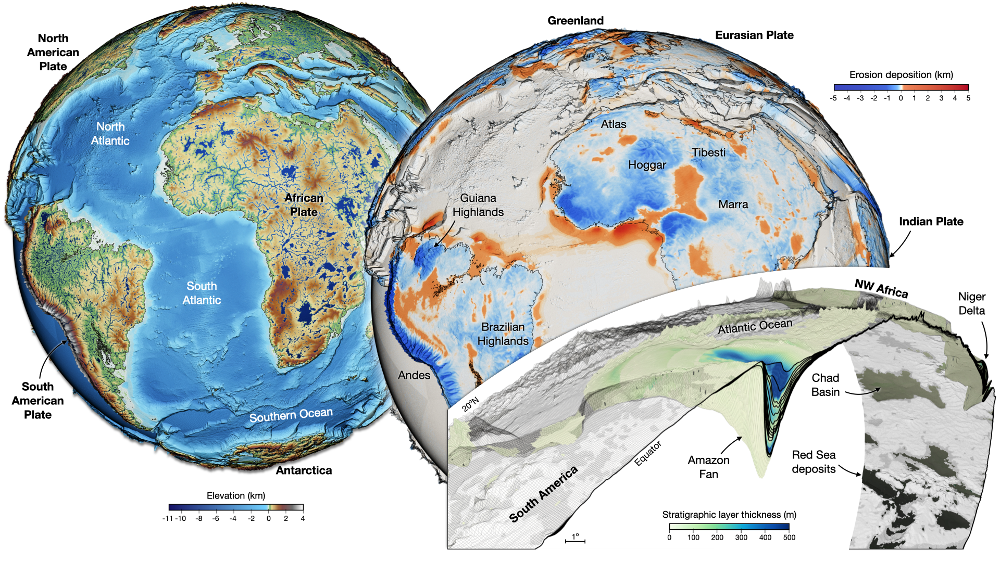

.. :notoc:
:html_theme.sidebar_secondary.remove: true

.. goSPL documentation master file, created by

.. module:: goSPL

********************
goSPL documentation
********************

**Date**: |today| **Version**: |version|

**Useful links**:
`Binary Installers <https://pypi.org/project/gospl>`__ |
`Source Repository <https://github.com/Geodels/gospl>`__ |
`Issues & Ideas <https://github.com/Geodels/gospl/issues>`__ 

**goSPL** (short for ``Global Scalable Paleo Landscape Evolution``) is an open source, GPL-licensed library providing a scalable parallelised Python-based numerical model to simulate landscapes and basins reconstruction at global scale. goSPL is developed by the `EarthCodeLab Group <https://earthcolab.org>`_ at the University of Sydney.

.. grid:: 1
    :padding: 4

    .. grid-item-card::  
        
        **Statement of need**
        ^^^

        Since the '90s, many software have been designed to estimate long-term catchment dynamic, drainage evolution as well as sedimentary basins formation  in response to various mechanisms such as tectonic or climatic forcing. These models rely on a set of mathematical and physical expressions that simulate sediment erosion, transport and deposition and can reproduce the first order complexity of Earth's surface geomorphological evolution.

        Yet, we were still missing a tool to evaluate **global scale** evolution of Earth surface and its interaction with the atmosphere, the hydrosphere, the tectonic and mantle dynamics. goSPL is the first model designed to address this gap. It can be used to better characterise many aspects of the Earth system ranging from the role of atmospheric circulation on physical denudation, from the influence of erosion and deposition of sediments on mantle convection, from the location and abundance of natural resources to the evolution of life.

Quick links to the Doc
------------------------

.. grid:: 1 1 2 2
    :gutter: 2 3 4 4

    .. grid-item-card::
        :img-top: _static/index_getting_started.svg
        :text-align: center

        **Getting started**
        ^^^

        New to goSPL Check out the getting started guide. It
        contains an introduction to the code installation.

        +++

        .. button-ref:: getting_started
            :color: secondary
            :click-parent:

            To the getting started guide

    .. grid-item-card::
        :img-top: _static/index_user_guide.svg
        :text-align: center

        **Technical guide**
        ^^^

        The technical guide provides in-depth information on the
        underlying physics of goSPL.

        +++

        .. button-ref:: tech_guide
            :color: secondary
            :click-parent:

            To the technical guide

    .. grid-item-card::
        :img-top: _static/index_contribute.svg
        :text-align: center

        **User guide**
        ^^^

        Learning how to use goSPL by running some pre- and post-processing examples available as Jupyter notebooks.

        +++

        .. button-ref:: user_guide
            :color: secondary
            :click-parent:

            To the user guide

    .. grid-item-card::
        :img-top: _static/index_api.svg
        :text-align: center

        **Developer guide**
        ^^^

        This guide contains a detailed description of
        goSPL API. It describes how methods work and functions have
        been declared.

        +++

        .. button-ref:: api_ref
            :color: secondary
            :click-parent:

            To the reference guide

Citing
------

As a matter of courtesy, we request that people using this code please cite our initial `paper <https://joss.theoj.org/papers/10.21105/joss.02804>`__ published in JOSS.

Salles et al. (2020) ’gospl: Global Scalable Paleo Landscape Evolution’, Journal of Open Source Software, 5(56), p. 2804. doi: 10.21105/joss.02804.

BibTeX::

    @article{salles2020,
        author={Salles, Tristan and Mallard, Claire and Zahirovic, Sabin},
        title={gospl: Global Scalable Paleo Landscape Evolution},
        journal={Journal of Open Source Software},
        year={2020},
        volume={5},
        number={56},
        pages={2804},
        DOI={10.21105/joss.02804}
    }

Contributing to goSPL
--------------------------

Contributions of any kind to goSPL are more than welcome. That does not mean new code only, but also improvements of documentation and user guide, additional tests (ideally filling the gaps in existing suite) or bug report or idea what could be added or done better.

All contributions should go through our GitHub repository. Bug reports, ideas or even questions should be raised by opening an issue on the GitHub tracker. Suggestions for changes in code or documentation should be submitted as a pull request. However, if you are not sure what to do, feel free to open an issue. All discussion will then take place on GitHub to keep the development of goSPL transparent.

If you decide to contribute to the codebase, ensure that you are using an up-to-date ``master`` branch. The latest development version will always be there, including the documentation (powered by ``sphinx``).

Details are available in the :doc:`contributing guide <contributing>`.

.. toctree::
    :maxdepth: 3
    :hidden:
    :titlesonly:

    Home <self>
    getting_started/index
    tech_guide/index
    user_guide/index
    api_ref/index
    Contributing <contributing>
