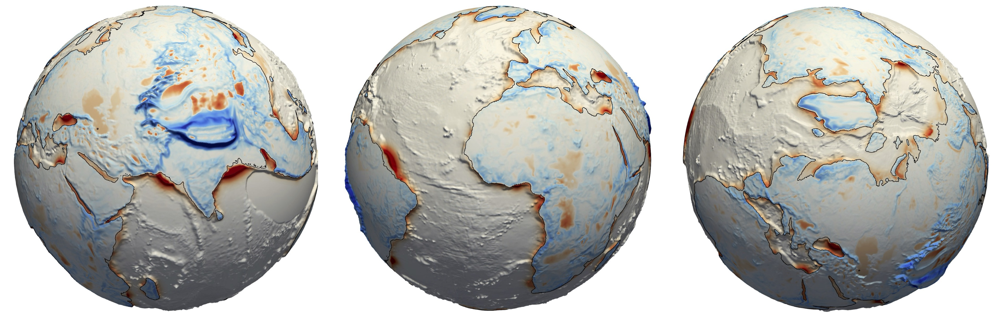

.. gospl documentation master file, created by
   sphinx-quickstart on Fri May 10 16:22:41 2019.
   You can adapt this file completely to your liking, but it should at least
   contain the root `toctree` directive.

Global Scalable Paleo Landscape Evolution / gospl
==================================================

.. image:: https://readthedocs.org/projects/gospl/badge/?version=latest
  :target: https://gospl.readthedocs.io/en/latest/?badge=latest
  :alt: Documentation Status

What's in the box?
------------------

**gospl** (pronounced: /ˈɡospel/, [ˈɡo̞s̠pe̞l]) is a scalable parallelised Python-based numerical model built to simulate paleo-landscapes and basins reconstruction at global scale.

**gospl** is a parallel TIN-based landscape evolution model, built to simulate topography dynamic of the Earth over millions of years.

The model accounts for hillslope processes (soil creep using linear diffusion), fluvial incision (stream power law), spatially and temporally varying tectonics (horizontal and vertical displacements) and climatic forces (temporal and spatial precipitation changes and/or sea-level fluctuations).

Specs
**********

The model is based on the following approaches:

+ an adaptation of the implicit, parallelisable method for calculating drainage area for both single (D8) and multiple flow direction (Dinf) from [Richardson14]_,
+ the methods developed in `badlands`_ [Salles18]_ for marine sediment distribution,
+ a `PETSc`_ layer similar to the one in `eSCAPE`_ [Salles19]_ for mash partitioning and solvers.

License
**********

.. image:: https://img.shields.io/badge/License-GPLv3-blue.svg
  :target: https://www.gnu.org/licenses/gpl-3.0
  :alt: License: GPL v3

This program is free software: you can redistribute it and/or modify it under the terms of the GNU Lesser General Public License as published by the Free Software Foundation, either version 3 of the License, or (at your option) any later version.

This program is distributed in the hope that it will be useful, but WITHOUT ANY WARRANTY; without even the implied warranty of MERCHANTABILITY or FITNESS FOR A PARTICULAR PURPOSE. See the GNU Lesser General Public License for more details.

You should have received a copy of the GNU Lesser General Public License along with this program. If not, see `LGPL3`_.

.. toctree::
   :maxdepth: 3
   :name: Usage
   :caption: Usage

   install.rst
   inputfile.rst
   examples.rst

.. toctree::
   :maxdepth: 3
   :name: Code Source
   :caption: Code Source

   api.rst

Indices and tables
------------------

* :ref:`genindex`
* :ref:`modindex`
* :ref:`search`

.. [Richardson14] Ribal, A. Hill, C. N. & Perron, J. T. -
    IDA: An implicit, parallelizable method for calculating drainage area. **Water Resour. Res.**, 50, 4110-4130, `doi:10.1002/2013WR014326`_, 2014.

.. [Salles18] Salles, T., Ding, X. & Brocard, G. -
    pyBadlands: A framework to simulate sediment transport, landscape dynamics and basin stratigraphic evolution through space and time. **PLOS ONE**, 13(4): e0195557, `doi:10.1371/journal.pone.0195557`_, 2018.

.. [Salles19] Salles, T. -
    eSCAPE: Regional to Global Scale Landscape Evolution Model v2.0. **Geosci. Model Dev.**, 12, 4165-4184, `doi:10.5194/gmd-12-4165-2019`_, 2019, 2019.

.. _`badlands`:  https://github.com/badlands-model/badlands

.. _`eSCAPE`:  https://github.com/Geodels/eSCAPE

.. _`PETSc`: https://www.mcs.anl.gov/petsc/

.. _`LGPL3`:  http://www.gnu.org/licenses/lgpl-3.0.en.html

.. _`doi:10.1002/2013WR014326`:  https://doi.org/10.1002/2013WR014326

.. _`doi:10.1371/journal.pone.0195557`: https://doi.org/10.1371/journal.pone.0195557

.. _`doi:10.5194/gmd-12-4165-2019`:  https://doi.org/10.5194/gmd-12-4165-2019
