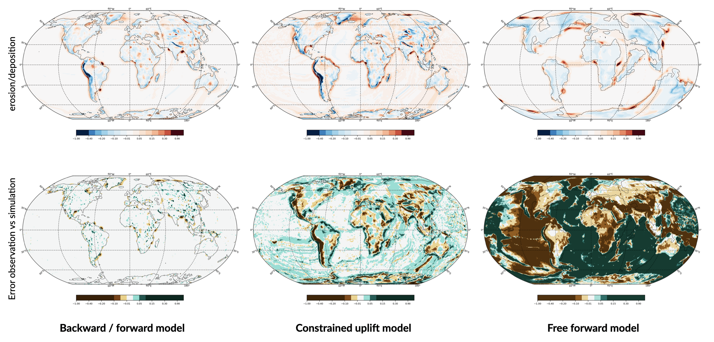

#################
Input file
#################

To get started on how to use *gospl*, a series of examples and tutorials is provided in the following `Examples`_ folder.

.. warning::
  Be aware that the `Examples`_ folder is quite large as it comes with several global input files...

Input files for *gospl* are based on `YAML`_ syntax.

The YAML structure is shown through indentation (one or more spaces) and sequence items are denoted by a dash. At the moment the following component are available:

.. role:: yaml(code)
   :language: yaml

:yaml:`domain`
--------------------

.. code:: yaml

  name: Global model from 20 Ma to present

  domain:
      npdata: 'input8/elev20Ma'
      flowdir: 5
      fast: False
      backward: False
      interp: 1
      overlap: 1
      rstep: 25

:yaml:`domain` defines the initial surface and set several simulation parameters. The following ones are **required**:

a. the initial spherical surface mesh :yaml:`npdata` as well as
b. the flow direction method to be used :yaml:`flowdir` that takes an integer value between 1 (for SFD) and 6 (for Dinf)

In addition the following optional parameters can be set:

c. the :yaml:`fast` key allows you to run a model without applying any surface processes on top. This is used to run backward model in a quick way, but can also potential be set to *True* if you want to check your input files prior to running a forward model with all options.
d. when running a backward model the :yaml:`backward` key has to be set to *True* as well!
e. the :yaml:`interp` key is set when running model with 3D cartesian displacements and allows you to choose the number of points that will be used when interpolating the spherical mesh after displacements. The key has 2 possible values: **1** or **3**. A value of **3** will take the 3 closest nodes to perform the interpolation and will tend to smooth the topography over time. A value of **1** will pick the closest point when performing the interpolation thus limiting the smoothing but potentially increasing the distorsion.
f. the :yaml:`overlap` key is set when running model with 3D cartesian displacements and specifies the number of ghost nodes used when defining the PETSc partition. It needs to be set so that all the points belonging to a single processors will not move further than the distances between the maximum horizontal displacement distance. The value will change depending of the resolution of your mesh.
g. to restart a simulation use the :yaml:`rstep` key and specify the time step number.

.. important::
  It is worth noting that all the input files require to run a *gospl* simulation must be defined as numpy zip array (**.npz**). This allows to directly and efficiently load the dataset during initialisation. This is specially efficient when running large models.

:yaml:`time`
--------------------

.. code:: yaml

  time:
      start: -20000000.
      end: 0.
      tout: 1000000.
      dt: 250000.
      tec: 1000000.
      strat: 500000.

:yaml:`time` is also required and set the model temparal evolution. The following parameters are required:

a. :yaml:`start` is the model start time in years,
b. :yaml:`end` is the model end time in years,
c. :yaml:`tout` is the output interval used to create model outputs,
d. :yaml:`dt` is the model internal time step (the approach in *gospl* uses an implicit time step.
e. :yaml:`tec` is the tectonic timestep interval used to update the tectonic meshes and perform the required displacements.
f. :yaml:`strat` is the stratigraphic timestep interval used to update the stratigraphic record.

.. important::
  In cases where the specify :yaml:`dt`, :yaml:`strat` and :yaml:`tec` parameters are greater than :yaml:`tout`, they will automatically be rescaled to match with the output interval. The :yaml:`tec` parameter should be set to similar to the temporal time step used in your reconstruction (usually around 1Ma). This time step is used to perform the horizontal displacements. The vertical displacements are updated for each time step. When turn-on the stratal records will be output at the same time as the output ones, but the file will potentially contain multiple stratigraphic layers per output if :yaml:`strat` is lower than :yaml:`tout`.

:yaml:`spl`
--------------------

.. code:: yaml

  spl:
      hfill: 100.
      K: 3.e-8
      Ff: 0.2

This part of the input file define the parameters for the fluvial surface processes based on the *Stream Power Law* (SPL) and is composed of:

a. :yaml:`hfill` the maximum filling elevation for depressions in the continental domain. This can be seen as a maximum lake elevation. This parameter has a default value of 100 m. It is used to avoid by-passing large depressions and to ensure deposition in endorheic basins.

b. :yaml:`K` representing the erodibility coefficient which is scale-dependent and its value depend on lithology and mean precipitation rate, channel width, flood frequency, channel hydraulics.

.. warning::
  It is worth noting that the coefficient *m* and *n* are fixed in this version of *gospl* and take the value of *0.5* & *1* respectively.

c. :yaml:`Ff` is the fraction of fine sediment which are eroded and will never be deposited in the marine environment either due to resuspension or dissolution. The minimal value is hard-coded to be at least 5% of the sediment load reaching the ocean. The user can chose an higher value if necessary.

.. important::
  The fraction of fines that is lost is only for the sediment reaching the coast and not for the sediments deposited in continental regions.

:yaml:`diffusion`
----------------------

.. code:: yaml

  diffusion:
      shelfslope: True
      hillslopeKa: 0.02
      hillslopeKm: 0.2
      sedimentK: 1000.

Hillslope processes in *gospl* is defined using a classical *diffusion law* in which sediment deposition and erosion depend on slopes (*simple creep*). The following parameters can be tuned based on your model resolution:

a. :yaml:`shelfslope` specifies the shelf maximum slope when marine sediments are deposited. By default (when set to False), the sediment are allowed to be deposited up to sea-level,
b. :yaml:`hillslopeKa` is the diffusion coefficient for the aerial domain,
c. :yaml:`hillslopeKm` is the diffusion coefficient for the marine domain,
d. :yaml:`sedimentK` is the diffusion coefficient for sediment deposited by rivers entering the marine environment.

:yaml:`sea`
--------------------

.. code:: yaml

  sea:
      position: 0.
      curve: 'data/sealevel.csv'

The sea-level declaration is defined with 2 optional parameters:

a. the relative sea-level :yaml:`position` in meters (optional),
b. a sea-level :yaml:`curve` *e.g.* a file containing 2 columns (time and sea-level position).

:yaml:`tectonic`
----------------------

.. code:: yaml

  tectonic:
    - start: -20000000.
      end: -19000000.
      mapH: 'input8/disp20Ma'
    - start: -19000000.
      end: -18000000.
      mapH: 'input8/disp19Ma'
    - start: -18000000.
      end: -17000000.
      mapH: 'input8/disp18Ma'
    - start: -17000000.
      end: -16000000.
      mapH: 'input8/disp17Ma'
      mapV: 'input8/dispv17Ma'
    - start: -16000000.
      end: -15000000.
      mapV: 'input8/dispv16Ma'

Follows the tectonic forcing conditions with a sequence of events defined by a starting time (:yaml:`start`) and either a vertical only forcing (*e.g.* uplift and/or subsidence defined with :yaml:`mapV`) or a fully 3D displacement mesh :yaml:`mapH`. These displacements are set in metres per year.

.. important::
  As mentioned above and for the next key parameter as well, these forcing files are defined as numpy zip array (**.npz**).

:yaml:`climate`
--------------------

.. code:: yaml

  climate:
    - start: -20000000.
      map: ['input8/rain20Ma','r']
    - start: -15000000.
      uniform: 1.

The climatic forcing is defined in a similar fashion as the tectonic one with again a sequence of events by a starting time (:yaml:`start`) and either an uniform rainfall over the entire mesh (:yaml:`uniform`) or with a precipitation mesh :yaml:`map`. The rainfall values have to be in metres per year.

:yaml:`forcepaleo`
-----------------------

.. code:: yaml

  forcepaleo:
      dir: 'output-backward'
      steps: [5,10,5]

For simulations that require to be forced with paleo-topography maps obtained from backward models, you will also have to set this key composed of 2 parameters:

a. :yaml:`dir` the directory containing the outputs of the backward model,
b. :yaml:`steps` the steps from the model outputs that will be used to force the forward model topography.

.. important::
  The :yaml:`steps` often correspond to the time where you have a paleotopography dataset that you want to match for example from a Scotese paleotopography map.

:yaml:`output`
--------------------

.. code:: yaml

  output:
      dir: 'forward'
      makedir: False

Finally, you will need to specify the output folder, with 2 possible parameters:

a. :yaml:`dir` gives the output directory name and
b. the option :yaml:`makedir` gives the ability to delete any existing output folder with the same name (if set to False) or to create a new folder with the given `dir` name plus a number at the end (*e.g.* outputDir_XX if set to True with XX the run number). It allows you to avoid overwriting on top of previous runs.

.. _`Paraview`: https://www.paraview.org/download/
.. _`YAML`: https://circleci.com/blog/what-is-yaml-a-beginner-s-guide/
.. _`Examples`: https://unisyd-my.sharepoint.com/:f:/g/personal/tristan_salles_sydney_edu_au/En8Wf56W_j9Jmqovx__PicgBczIcUogo6WuR-TVzZMHIMg?e=2pFtqT
