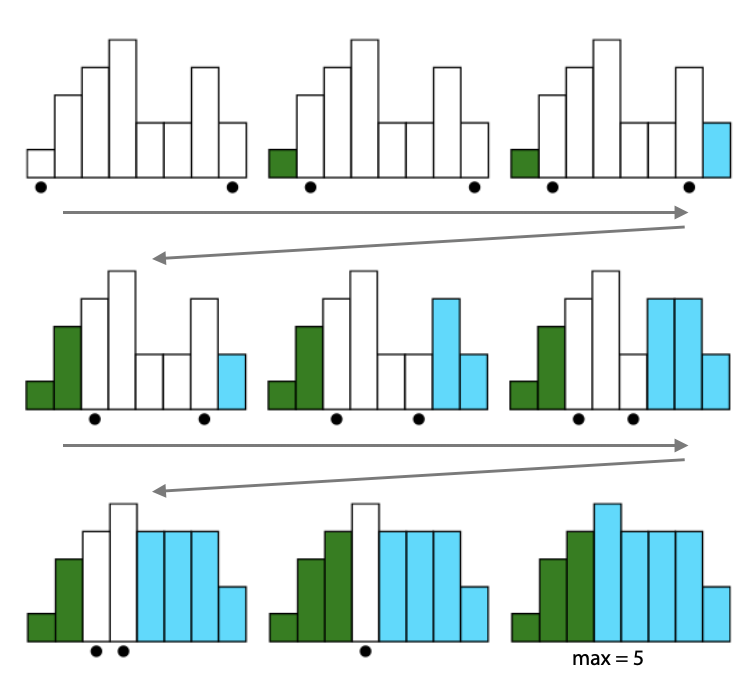
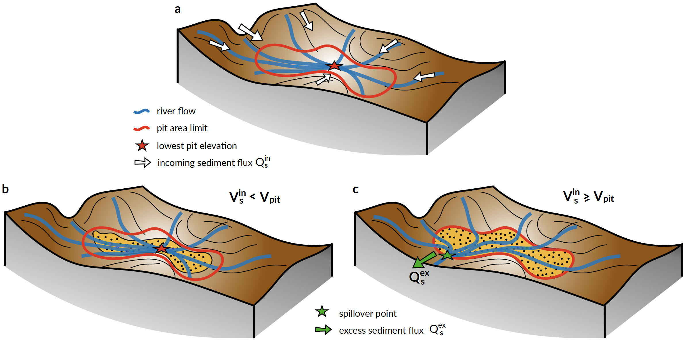

.. _dep:

==================================
Inland depressions & deposition
==================================

Priority-flood
---------------------------------

In most landscape evolution models, internally-draining regions (*e.g.*, depressions and pits) are usually filled before the calculation of flow discharge and erosion-deposition rates. This ensures that all flows conveniently reach the coast or the boundary of the simulated domain. In models intended to simulate purely erosional features, such depressions are usually treated as transient features and often ignored.

.. note::

  However, goSPL is designed to not only address erosion problems but also to simulate source-to-sink transfer and sedimentary basins formation and evolution in potentially complex tectonic settings. In such cases, depressions may be formed at different periods during runtime and may be filled or remain internally drained (*e.g.*, endorheic basins) depending on the volume of sediment transported by upstream catchments.

Depression filling approaches have received some attention in recent years with the development of new and more efficient algorithms such as the work from `Barnes et al. (2016) <https://arxiv.org/pdf/1606.06204.pdf>`_. These methods based on **priority-flood**  offer a time complexity of the order of :math:`\mathrm{O(Nlog(N))}`.

Priority-flood algorithms consist in finding the minimum elevation a cell needs to be raised to (*e.g.*, spill elevation of a cell) to prevent downstream ascending path to occur. They rely on priority queue data structure used to efficiently find the lowest spill elevation in a grid.

  The Priority-Flood begins by adding all of the edge cells to the priority queue. Queued cells are represented by a black circle. Each edge cell is the mouth of its own watershed, represented with different colours here. The queue's lowest cell c is dequeued and its neighbours added to the queue; the neighbours inherit c's watershed label. Depressions are filled in. When two different watersheds meet, the maximum elevation of the two meeting cells is noted: here there are five distinct elevation levels and the two watersheds meet at an elevation of 5. If this noted elevation is the lowest of any meeting of the two watersheds, it is retained as the watersheds' spillover elevation (from Barnes et al. (2014)).

In goSPL, the priority-flood algorithm proposed in `Barnes et al. (2016) <https://arxiv.org/pdf/1606.06204.pdf>`_ is implemented. It provides a solution to remove automatically flat surfaces.

The approach proposed in goSPL is more general than the one in the initial paper. First, it handles both regular and irregular meshes, allowing for complex distributed meshes to be used as long as a clear definition of inter-mesh connectivities is available. Secondly, to prevent iteration over unnecessary vertices (such as marine regions), it is possible to define a minimal elevation (i.e. sea-level position) above which the algorithm is performed. Finally, it creates directions over flat regions allowing for downstream flows in cases where the entire volume of a depression is filled.

.. important::

  The priority-flood algorithm returns the **flooded elevation** and for each depression its **volume**, its **spill over node**  and a **basin unique identifier** assigned to each of the nodes belonging to the depression.

Parallel implementation
---------------------------------

On a distributed (MPI) mesh goSPL follows the three-phase structure of `Barnes et al. (2016) <https://arxiv.org/pdf/1606.06204.pdf>`_:

1. **Per-tile flood (parallel).** Each processor priority-floods its own partition and emits a small *spillover graph* whose nodes are the local depression labels and whose edges record the minimum elevation at which one basin spills into another (including a special "ocean"/edge label).
2. **Global graph solve (serial, on rank 0).** The per-tile graphs are gathered, the labels that describe the same basin across a partition boundary are unified, and a single priority-flood **on the graph** computes the final water level of every depression. Because the graph scales with the *boundary* length (:math:`\mathrm{O(\sqrt{N})}` per tile) rather than the domain area, this master solve is intentionally serial — it is cheap even for very large meshes.
3. **Apply (parallel).** Each processor raises its cells to the per-label water levels.

.. note::

  The cross-partition label unification (step 2) uses a **union-find** (disjoint-set) pass: every connected component of the equivalence graph is collapsed to its minimum label in a single deterministic sweep. This makes the depression identifiers **independent of how the domain is partitioned** — the filled surface is identical regardless of the number of processors. The serial graph solve itself uses a binary-heap priority queue and a compact (densely re-indexed) label space so its cost tracks the number of distinct spillover basins, not the (rank-dependent, globally-offset) raw label range.

  The rest of the depression *graph* built on the filled surface is partition-invariant for the same reason — every tie is broken by the node's input-mesh index rather than the (partition-dependent) local ordering. Pit **membership** (the connected set of equal-fill cells reaching a depression bottom), each pit's **spill point** (the lowest-index qualifying rim cell), and the **flat-region routing** toward that spill (a relaxed shortest-path distance) are therefore identical across any number of processors. As a result the assembled flow operator — and in particular the set of genuinely un-drainable isolated pockets that fall back to local sinks — is bit-for-bit reproducible regardless of the decomposition.

Depression filling
---------------------------------

Once the volumes of these depressions have been obtained, their subsequent filling is dependent of the sediment fluxes calculation defined in the :ref:`previous section <ero>` (Fig. 4a).

  Illustration of the two cases that may arise depending on the volume of sediment entering an internally drained depression (panel **a**). The red line shows the limit of the depression at the minimal spillover elevation. **b)** The volume of sediment (:math:`\mathrm{V_s^{in}}`) is lower than the depression volume :math:`\mathrm{V_{pit}}`. In this case all sediments are deposited and no additional calculation is required. **c)** If :math:`\mathrm{V_s^{in}\ge V_{pit}}`, the depression is filled up to depression filling elevation (priority-flood + :math:`\mathrm{\epsilon}`), the flow calculation needs to be recalculated and the excess sediment flux (:math:`\mathrm{Q_s^{ex}}`) is transported to downstream nodes.

In cases where the incoming sediment volume is lower than the depression volume (Fig. 4b), all sediments are deposited and the elevation at node :math:`i` in the depression is increased by a thickness :math:`\mathrm{\delta_i}` such that:

.. math::

    \mathrm{\delta_{i}} = \mathrm{\Upsilon (\eta^{f}_{i}-\eta_{i})}

where :math:`\mathrm{\eta^{f}_{i}}` is the filling elevation of node :math:`\mathrm{i}` obtained with the priority-flood algorithm and  the ratio :math:`\mathrm{\Upsilon}` is set to :math:`\mathrm{V_s^{in}/V_{pit}}`.

If the cumulative sediment volume  transported by the rivers draining in a specific depression is above the volume of the depression (:math:`\mathrm{V_s^{in} \ge V_{pit}}` - Fig. 4c) the elevation of each node :math:`\mathrm{i}` is increased to its filling elevation (:math:`\mathrm{\eta^{f}_{i}}`) and the excess sediment volume is allocated to the spillover node (Fig. 4c).

The updated elevation field is then used to compute the flow accumulation following the approach presented in section :ref:`1 <flow>` and :ref:`2 <ero>`. The sediment fluxes are initially set to zero except on the spillover nodes and the excess sediments are transported downstream.

During a specific time step, the processed described above is iteratively repeated until all sediments are deposited in inlands depressions or have entered the marine environment.

Partial-fill geometry in large/deep depressions
-----------------------------------------------

For depressions that receive *less* sediment than their volume in a given time step (:math:`\mathrm{V_s^{in} < V_{pit}}`), goSPL chooses between two deposition geometries depending on the depression size and depth. Both are mass-conservative; they differ only in *how* the deposit is distributed within the basin.

**Path 1 — bottom-up fill (small or shallow pits).**

When a depression is small or shallow (volume below ``nlPitVolume`` *or* depth below ``nlPitDepth`` in the YAML ``diffusion`` block), the deposit is added as a horizontal layer that fills the bowl from the bottom up. The deposited surface is set to a target level :math:`\mathrm{\eta^t}` determined by interpolating the volume-vs-level table built when the pit was labelled:

.. math::

   \mathrm{\delta_i = \max(0,\; \min(\eta^t,\; \eta^f_i) - \eta_i)}

A barely-perceptible (~:math:`\mathrm{10^{-6}}` m/m) tilt toward the spill point is then added so the next flow-routing step does not face a perfectly flat lake surface.

**Path 2 — bathymetric pile + inlet bias (large and deep pits).**

When a depression is *both* large in volume (``volume >= nlPitVolume``) and deep (``depth >= nlPitDepth``), a horizontal fill looks artificial because real lakes accumulate sediment both at the inlet (delta progradation) and across the basin floor (suspended settling). goSPL therefore builds the deposit as the sum of two contributions:

1. A **bathymetric baseline** that distributes a fraction :math:`\mathrm{(1 - b)}` of the deposited volume proportionally to local water depth below the target level:

   .. math::

      \mathrm{\delta_i^{bath}} = \mathrm{(1 - b)\; \frac{V_s^{in}\; w_i}{\sum_j w_j \Omega_j},\quad w_i = \max(0,\; \eta^t - \eta_i)}

2. An **inlet bias** that concentrates the remaining fraction :math:`\mathrm{b}` of the volume at the cells where flow enters the depression from outside (the natural delta-formation cells):

   .. math::

      \mathrm{\delta_c^{inlet}} = \mathrm{\frac{b\; V_s^{in}}{n_{\text{inlets}}\; \Omega_c}}

The combined initial pile is then passed through the marine-style non-linear diffusion solver (with coefficient ``nlPitK``), restricted to the in-pit cells, so neither contribution can spill out of the basin. A final per-pit mass rescale absorbs any boundary drift introduced by the diffusion.

.. important::

   The inlet bias fraction :math:`\mathrm{b}` is set in the YAML ``diffusion`` block via the ``pitInletBias`` key (default ``0.10``, clamped to ``[0, 1]``). Lower values (0.0–0.2) produce mostly bowl-fill geometry; mid-range values (0.3–0.6) produce visible delta progradation while still filling the basin interior; high values (>0.7) reproduce the older "inlet spike" behaviour that tends to look blocky at the rim. Tune in conjunction with ``nlPitK``, which controls how far the delta wedge progrades under diffusion (length :math:`\sim \sqrt{K \Delta t}`).
