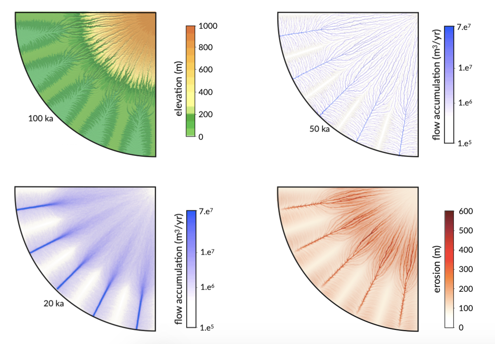

.. _ero:

==============================
Erosion rate and sediment flux
==============================

Stream power law
------------------------------------

River incision, associated sediment transport and subsequent deposition are critical elements of landscape evolution models.

In goSPL, a detachment-limited approach is implemented. The detachment-limited hypothesis supposes that erosion is not limited by a transport capacity but instead by the ability of rivers to remove material from the bed.
The sediment erosion rate is expressed using a **stream power** formulation function of river discharge, precipitation and slope (`Howard et al., 1994 <https://agupubs.onlinelibrary.wiley.com/doi/abs/10.1029/94JB00744%4010.1002/%28ISSN%292169-9356.TECTOP1>`_).

.. note::

  The proposed formulation differs from traditional ones in that it relates explicitly incision to precipitation following the approach described in `Murphy et al. (2016) <https://www.nature.com/articles/nature17449>`_. This modification allows to account for local climatic control of bedrock river incision induced by chemical weathering. Weathering is known to strongly contribute to erosion and to largely influence sediment load distributed to downstream catchments. Studies have shown that the physical strength of bedrock which varies with the degree of chemical weathering, increases systematically with local rainfall rate. The proposed formulation expresses in a simple mathematical form the following two feedbacks between chemical weathering and erosion:

  1. weathering tends to weaken bedrocks, increasing their erodibility.
  2. enhanced erosion rates exposes fresh rocks at the surface therefore contributing to increased weathering.

The volumetric entrainment flux of sediment per unit bed area :math:`\mathrm{E}` is of the following form:

.. math::

  \mathrm{E} =  \mathrm{\kappa P^d Q^m S^n}

where :math:`\mathrm{\kappa}` is the precipitation-independent sediment erodibility parameter, :math:`\mathrm{P}` the annual precipitation rate, :math:`\mathrm{d}` is a positive exponent, :math:`\mathrm{Q}=\bar{P}A` is the water discharge (computed in the :ref:`River Discharge <flow>` section with :math:`\mathrm{A}` the flow accumulation) and :math:`\mathrm{S}` is the river local slope. :math:`\mathrm{m}` and :math:`\mathrm{n}` are scaling exponents.  In goSPL, :math:`\mathrm{\kappa}` is user defined and the coefficients :math:`\mathrm{m}` and :math:`\mathrm{n}` are set to 0.5 and 1 respectively.  :math:`\mathrm{E}` is in :math:`\mathrm{m/y}` and therefore the erodibility dimension is :math:`\mathrm{m\,y^{-0.5}}`.

The elevation (:math:`\mathrm{\eta_i}`) will change due to local river erosion rate and is defined implicitly by:

.. math::

	\mathrm{\frac{\eta_i^{t+\Delta t}-\eta_i^t}{\Delta t}} =  \mathrm{-\kappa P^d_i \sqrt{Q_i} \frac{\eta_i^{t+\Delta t} - \eta_{rcv}^{t+\Delta t}}{\lambda_{i,rcv}}}

where :math:`\mathrm{\lambda_{i,rcv}}` is the length of the edges connecting the considered vertex to its receiver. Rearranging the above equation gives:

.. math::

  \mathrm{(1+K_{f,i|rcv}) \eta_i^{t+\Delta t} - K_{f,i|rcv} \eta_{i,rcv}^{t+\Delta t}} = \mathrm{\eta_i^t}

with the coefficient :math:`\mathrm{K_{f,i|rcv} = \kappa P^d_i \sqrt{Q_i} \Delta t / \lambda_{i,rcv}}`.

Matrix formalism
------------------------------------

In matrix form the system defined above  is equivalent to:

.. math::

  \mathrm{\boldsymbol\Gamma \boldsymbol\eta} \mathrm{^{t+\Delta t}} = \mathrm{\boldsymbol\eta} \mathrm{^{t}}

Using the example presented in the figure 1 in section :ref:`River Discharge <flow>` and considering the **multiple flow direction** scenario, the matrix system based on the receivers distribution is defined as:

.. math::
  \begin{align}
  \begin{bmatrix}
     \mathrm{\gamma_{1,1}} & - \mathrm{\gamma_{1,2}} & & - \mathrm{\gamma_{1,4}} & - \mathrm{\gamma_{1,5}} & & & & & \\
        &  \mathrm{\gamma_{2,2}} & - \mathrm{\gamma_{2,3}}  & - \mathrm{\gamma_{2,4}} & & & & & & \\
       &   &  \mathrm{\gamma_{3,3}} & & & & & -\mathrm{\gamma_{3,8}} & -\mathrm{\gamma_{3,9}} & \\
        &   & - \mathrm{\gamma_{4,3}}  &  \mathrm{\gamma_{4,4}} &  - \mathrm{\gamma_{4,5}} & - \mathrm{\gamma_{4,6}}& & -\mathrm{\gamma_{4,8}} & & \\
       &  & &&  \mathrm{\gamma_{5,5}} &  - \mathrm{\gamma_{5,6}} & & & & \\
       & & &  &&  \mathrm{\gamma_{6,6}} & & -\mathrm{\gamma_{6,8}} & & \\
       & & & & & - \mathrm{\gamma_{7,6}} &  \mathrm{\gamma_{7,7}} & -\mathrm{\gamma_{7,8}} & & \\
       & &  &  & &   &  &\mathrm{\gamma_{8,8}} & -\mathrm{\gamma_{8,9}} & \\
       & & & & & & &  & 1 &  \\
       & & & & & & - \mathrm{\gamma_{10,7}} & -\mathrm{\gamma_{10,8}} & -\mathrm{\gamma_{10,9}} &  \mathrm{\gamma_{10,10}}
  \end{bmatrix}
   \begin{bmatrix}
      \mathrm{\eta_1^{t+\Delta t}} \\
      \mathrm{\eta_2^{t+\Delta t}} \\
      \mathrm{\eta_3^{t+\Delta t}} \\
      \mathrm{\eta_4^{t+\Delta t}} \\
      \mathrm{\eta_5^{t+\Delta t}} \\
      \mathrm{\eta_6^{t+\Delta t}} \\
      \mathrm{\eta_7^{t+\Delta t}} \\
      \mathrm{\eta_8^{t+\Delta t}} \\
      \mathrm{\eta_9^{t+\Delta t}} \\
      \mathrm{\eta_{10}^{t+\Delta t}}
  \end{bmatrix}
  =  \begin{bmatrix}
      \mathrm{\eta_1^{t}} \\
      \mathrm{\eta_2^{t}} \\
      \mathrm{\eta_3^{t}} \\
      \mathrm{\eta_4^{t}} \\
      \mathrm{\eta_5^{t}} \\
      \mathrm{\eta_6^{t}} \\
      \mathrm{\eta_7^{t}} \\
      \mathrm{\eta_8^{t}} \\
      \mathrm{\eta_9^{t}} \\
      \mathrm{\eta_{10}^{t}}
  \end{bmatrix}\label{eq:SPACE8}
  \end{align}

with

.. math::
  \begin{array}{ccl}
    \mathrm{\gamma_{i,j}} & = &  \mathrm{w_{i,j}K_{f,i|j}} \qquad i \ne j \\
    \mathrm{\gamma_{1,1}} & = &  1 + \mathrm{\sum\limits_{j=2,4,5} w_{1,j}K_{f,1|j} } \\
    \mathrm{\gamma_{2,2}}  & = &1 +  \mathrm{\sum\limits_{j=3,4} w_{2,j}K_{f,2|j} } \\
    \mathrm{\gamma_{3,3}} & = &  1 + \mathrm{\sum\limits_{j=8,9} w_{3,j}K_{f,3|j} } \\
    \mathrm{\gamma_{4,4}} & = & 1 +  \mathrm{\sum\limits_{j=3,5,6,8} w_{4,j}K_{f,4|j} }\\
    \mathrm{\gamma_{5,5}}  & = & 1 +  \mathrm{ w_{5,6}K_{f,5|6} }  \\
    \mathrm{\gamma_{6,6}}  & = &  1 + \mathrm{ w_{6,8}K_{f,6|8}}  \\
    \mathrm{\gamma_{7,7}}  & = & 1 +  \mathrm{ \sum\limits_{j=6,8} w_{7,j}K_{f,7|j}} \\
    \mathrm{\gamma_{8,8}}  & = & 1 +  \mathrm{w_{8,9}K_{f,8|9}} \\
    \mathrm{\gamma_{10,10}}  & = &  1 + \mathrm{\sum\limits_{j=7,8,9} w_{10,j}K_{f,10|j}}
  \end{array}

The above system is **implicit** and the matrix is **sparse**. The `SciPy <https://docs.scipy.org/doc/scipy/reference/generated/scipy.sparse.csr_matrix.html>`_ compressed sparse row matrix functionality is used here again to build  :math:`\mathrm{\boldsymbol\Gamma}` on each local domain. The SciPy matrix format (*e.g.* csr_matrix) is efficiently loaded as a `PETSc <https://www.mcs.anl.gov/petsc/>`_ Python matrix and the system is then solved using *Richardson solver* with block Jacobi preconditioning (*bjacobi*) using an initial guess for the solution set to vertices elevation.

   Flow accumulation patterns and associated erosion based on a radially symmetric surface defined with a central, high region and a series of distal low-lying valleys. Resulting topography after 100,000 years of evolution under uniform precipitation for the multiple flow direction algorithms. Patterns of flow accumulation after 20,000 and 50,000 years are presented as well as estimated landscape erosion at the end of the simulation time.

Sediment entrainment
------------------------

Once the erosion rates have been obtained, the sediment flux moving out at every node :math:`\mathrm{Q_s^{out}}`  equals the flux of sediment flowing in plus the local erosion rate. :math:`\mathrm{Q_s^{out}}` takes the following form:

.. math::

   \mathrm{Q_s^{out}} = \mathrm{Q_s^{in} + E \Omega}

:math:`\mathrm{\Omega}` is the voronoi area of the considered vertex.

The solution of the above equation requires the calculation of the incoming sediment volume from upstream nodes :math:`\mathrm{Q_s^{in}}`.  At node :math:`\mathrm{i}`, this equation is equivalent to:

.. math::

   \mathrm{q_{s,i}} = \mathrm{e_{i} + \sum_{d=1}^{N_d}q_{s,d}}

where :math:`\mathrm{e_{i} = E_{i} \Omega_i}` and :math:`\mathrm{N_d}` is the number of donors. Assuming that river sediment concentration is distributed in a similar way as the water discharge we write the following set of equalities for our example:

.. math::
  \begin{align}
  \begin{bmatrix}
      1 & & & & & & & & & \\
       \mathrm{-w_{1,2}} & 1 & & & & & & & & \\
       &  \mathrm{-w_{2,3}} & 1 & \mathrm{-w_{4,3}} & & & & & & \\
       \mathrm{-w_{1,4}} &  \mathrm{-w_{2,4}} & & 1 & & & & & & \\
       \mathrm{-w_{1,5}} &  & & \mathrm{-w_{4,5}} & 1 & & & & & \\
       & & & \mathrm{-w_{4,6}} & \mathrm{-w_{5,6}} & 1 & \mathrm{-w_{7,6}} & & & \\
       & & & & & & 1 & & & \mathrm{-w_{10,7}}\\
       & & \mathrm{-w_{3,8}} & \mathrm{-w_{4,8}} & & \mathrm{-w_{6,8}} & \mathrm{-w_{7,8}} & 1 & & \mathrm{-w_{10,8}} \\
       & & \mathrm{-w_{3,9}} & & & & & \mathrm{-w_{8,9}} & 1 & \mathrm{-w_{10,9}} \\
       & & & & & & & & & 1
  \end{bmatrix}
   \begin{bmatrix}
      \mathrm{q_{s,1}} \\
      \mathrm{q_{s,2}} \\
      \mathrm{q_{s,3}} \\
      \mathrm{q_{s,4}} \\
      \mathrm{q_{s,5}} \\
      \mathrm{q_{s,6}} \\
      \mathrm{q_{s,7}} \\
      \mathrm{q_{s,8}} \\
      \mathrm{q_{s,9}} \\
      \mathrm{q_{s,10}}
  \end{bmatrix}
  =  \begin{bmatrix}
      \mathrm{e_1} \\
      \mathrm{e_2} \\
      \mathrm{e_3} \\
      \mathrm{e_4} \\
      \mathrm{e_5} \\
      \mathrm{e_6} \\
      \mathrm{e_7} \\
      \mathrm{e_8} \\
      \mathrm{e_9} \\
      \mathrm{e_{10}}
  \end{bmatrix}
  \end{align}

It is worth noting that in this system, the matrix **W** is the same as the one proposed for the :ref:`River Discharge <flow>` and therefore does not have to be built.  As for the previous system, this one is solved using the `PETSc <https://www.mcs.anl.gov/petsc/>`_ solver previously defined to find the :math:`\mathrm{q_{s,i}}` values implicitly.

SPL with sediment deposition
--------------------------------

An alternative method to the detachment-limited approach proposed above consists in accounting for the role played by sediment in modulating erosion and deposition rates. It follows the model of `Yuan et al, 2019 <https://agupubs.onlinelibrary.wiley.com/doi/full/10.1029/2018JF004867>`_, whereby the deposition flux depends on a deposition coefficient :math:`G` and is proportional to the ratio between cell area :math:`\mathrm{\Omega}` and water discharge :math:`\mathrm{Q}=\bar{P}A`. 

The approach considers the local balance between erosion and deposition and is based on sediment flux resulting from net upstream erosion. 

.. math::

	\mathrm{\frac{\eta_i^{t+\Delta t}-\eta_i^t}{\Delta t}} =  \mathrm{-\kappa P^d_i \sqrt{Q_i} \frac{\eta_i^{t+\Delta t} - \eta_{rcv}^{t+\Delta t}}{\lambda_{i,rcv}}} + \mathrm{G' Q_{s_i} / \Omega_i}

where :math:`\mathrm{\lambda_{i,rcv}}` is the length of the edges connecting the considered vertex to its receiver and :math:`\mathrm{\Omega_i}` is the area (voronoi) of the node :math:`i`. 

:math:`\mathrm{Q_{s_i}}` is the upstream incoming sediment flux in m3/yr and :math:`\mathrm{G'}` is equal to :math:`\mathrm{G \Omega_i / \bar{P}A}`.

The upstream incoming sediment flux is obtained from the total sediment flux :math:`\mathrm{Q_{t_i}}` where:

.. math::

	\mathrm{Q_{t_i}^{t+\Delta t} - \sum_{ups} w_{i,j} Q_{t_u}^{t+\Delta t}}= \mathrm{(\eta_i^{t} - \eta_i^{t+\Delta t}) \frac{\Delta t}{\Omega_i}}

which gives:

.. math::

	\mathrm{Q_{s_i}} = \mathrm{Q_{t_i}} - \mathrm{(\eta_i^{t} - \eta_i^{t+\Delta t}) \frac{\Delta t}{\Omega_i}}

This system of coupled equations is solved implicitly using PETSc by assembling the matrix and vectors using the nested submatrix and subvectors and by using the ``fieldsplit`` preconditioner combining two separate preconditioners for the collections of variables. 

The ``TFQMR`` (transpose-free QMR (quasi minimal residual)) KSP solver is used to solve the coupled system with sub KSPs set to ``preonly`` and preconditioner set to ``hypre``. (See PETSC documentation for more details about the solver and preconditoner options and settings).  
