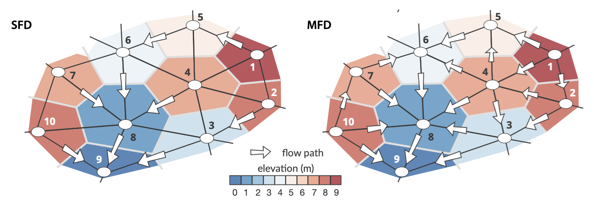

.. _flow:

=========================
River Discharge
=========================

Flow accumulation
------------------------------------

Flow accumulation (FA) calculations are core component of landscape evolution models as they are often used as proxy to estimate flow discharge, sediment load, river width, bedrock erosion as well as sediment deposition.

.. note::

  Until recently conventional FA algorithms were **serial** and limited to small spatial problems. With ever growing high resolution digital elevation dataset, new methods based on **parallel** approaches have been proposed over the last decade.

In addition, nearly all of these parallel approaches assume a **single flow direction** (SFD).  This assumption makes the emergent flow network highly sensitive to the underlying mesh geometry and most dendritic shape of obtained stream networks is often an artefact of the surface triangulation. To reduce this effect, authors have proposed to consider not only the steepest downhill direction but also to represent other directions appropriately weighted by slope (**multiple flow direction** - MFD).  Using MFD algorithms prevent locking of erosion pathways along a single direction and help to route flow over flat regions into multiple branches.

   Schematic diagram showing flow paths when considering a triangular irregular network composed of 10 vertices (node IDs are given for each case). Cells (*i.e.* voronoi area defining the region of influence of each vertex) are coloured by elevation. Two cases are presented considering single flow direction (left -- SFD) and multiple flow direction (right -- MFD). White arrows indicate flow direction and their sizes vary in proportion to slope (not at scale). Nodes numbers correspond to the subscripts in equations defined below.

Single and multiple flow directions
------------------------------------

goSPL allows for both SFD and MFD routing by using an adapted version of the parallel implicit drainage area (IDA) method from `Richardson et al. (2014) <https://agupubs.onlinelibrary.wiley.com/doi/full/10.1002/2013WR014326>`_  to unstructured meshes. It consists in writing the FA calculation as a *sparse matrix system of linear equations* and takes full advantage of purpose-built, efficient linear algebra routines available in `PETSc <https://www.mcs.anl.gov/petsc/>`_.

The river discharge is computed from the calculated FA and the net precipitation rate :math:`\mathrm{P}`.
At node :math:`\mathrm{i}`, the river discharge (:math:`\mathrm{q_i}`) is determined as follows:

.. math::

  \mathrm{q_i} = \mathrm{b_i} + \mathrm{\sum_{d=1}^{N_d} q_d}

where :math:`\mathrm{b_i}` is the local volume of water :math:`\mathrm{\Omega_i P_i}` where :math:`\mathrm{\Omega_i}` is the voronoi area and :math:`\mathrm{P_i}` the local precipitation value available for runoff during a given time step. :math:`\mathrm{N_d}` is the number of donors with a donor defined as a node that drains into :math:`\mathrm{i}` (as an example the donor of vertex 5 in the SFD sketch in the above figure is 1). To find the donors of each node, the method consists in finding their receivers first. Then, the receivers of each donor is saved into a receiver matrix, noting that the nodes, which are local minima, are their own receivers.

The transpose of the matrix is then used to get the donor matrix. When the previous equation is applied to all nodes and considering the MFD case illustrated above, the following relations are obtained:

.. math::

  \mathrm{q_1} &= \mathrm{b_1} \\
  \mathrm{q_2} &= \mathrm{b_2 + q_1 w_{1,2}}  \\
  \mathrm{q_3} &= \mathrm{b_3 + q_2 w_{2,3} + q_4 w_{4,3} } \\
  \mathrm{q_4} &= \mathrm{b_4 +  q_1 w_{1,4} + q_2 w_{2,4}}  \\
  \mathrm{q_5} &= \mathrm{b_5 + q_1 w_{1,5} + q_4 w_{4,5}} \\
  \mathrm{q_6} &= \mathrm{b_6 + q_4 w_{4,6} + q_5 w_{5,6} + q_7 w_{7,6}}  \\
  \mathrm{q_7} &= \mathrm{b_7 + q_{10} w_{10,7}} \\
  \mathrm{q_8} &= \mathrm{b_8 + q_3 w_{3,8} + q_4 w_{4,8} + q_6 w_{6,8} + q_7 w_{7,8} + q_{10} w_{10,8}}\\
  \mathrm{q_9} &= \mathrm{b_9 + q_3 w_{3,9} + q_8 w_{8,9} + q_{10} w_{10,9}}

The choice of weights :math:`\mathrm{w_{m,n}}` depends on the number of flow directions that is used. The weights range between zero and one and sum to one for each node:

.. math::

  \mathrm{\sum_n w_{m,n}} = 1

The number of flow direction paths is user-defined and can vary from 1 (*i.e.* SFD) up to 6 (*i.e.* MFD) depending of the grid neighbourhood complexity. The weights are calculated based on the number of downslope neighbours and are proportional to the slope.

Linear solver
---------------

In matrix form the system defined above  is equivalent to **W q** = **b** or:

.. math::
  \begin{align}
  \begin{bmatrix}
      1 & & & & & & & & & \\
       \mathrm{-w_{1,2}} & 1 & & & & & & & & \\
       &  \mathrm{-w_{2,3}} & 1 & \mathrm{-w_{4,3}} & & & & & & \\
       \mathrm{-w_{1,4}} &  \mathrm{-w_{2,4}} & & 1 & & & & & & \\
       \mathrm{-w_{1,5}} &  & & \mathrm{-w_{4,5}} & 1 & & & & & \\
       & & & \mathrm{-w_{4,6}} & \mathrm{-w_{5,6}} & 1 & \mathrm{-w_{7,6}} & & & \\
       & & & & & & 1 & & & \mathrm{-w_{10,7}}\\
       & & \mathrm{-w_{3,8}} & \mathrm{-w_{4,8}} & & \mathrm{-w_{6,8}} & \mathrm{-w_{7,8}} & 1 & & \mathrm{-w_{10,8}} \\
       & & \mathrm{-w_{3,9}} & & & & & \mathrm{-w_{8,9}} & 1 & \mathrm{-w_{10,9}} \\
       & & & & & & & & & 1
  \end{bmatrix}
   \begin{bmatrix}
      \mathrm{q_1} \\
      \mathrm{q_2} \\
      \mathrm{q_3} \\
      \mathrm{q_4} \\
      \mathrm{q_5} \\
      \mathrm{q_6} \\
      \mathrm{q_7} \\
      \mathrm{q_8} \\
      \mathrm{q_9} \\
      \mathrm{q_{10}}
  \end{bmatrix}
  =  \begin{bmatrix}
      \mathrm{b_1} \\
      \mathrm{b_2} \\
      \mathrm{b_3} \\
      \mathrm{b_4} \\
      \mathrm{b_5} \\
      \mathrm{b_6} \\
      \mathrm{b_7} \\
      \mathrm{b_8} \\
      \mathrm{b_9} \\
      \mathrm{b_{10}}
  \end{bmatrix}
  \end{align}

The vector **q** corresponds to the unknown river discharge (volume of water flowing on a given node per year) and the elements of **W** left blank are zeros.

.. note::

  As explained in `Richardson et al. (2014) <https://agupubs.onlinelibrary.wiley.com/doi/full/10.1002/2013WR014326>`_, the above system is implicit as the river discharge for a given vertex depends on its neighbours unknown flow discharge. The matrix **W** is sparse and is composed of diagonal terms set to unity (identity matrix) and off-diagonal terms corresponding to at most the immediate neighbours of each vertex (typically lower than 6 in constrained Delaunay triangulation).

In goSPL, this matrix is built in parallel using compressed sparse row matrix functionality available from `SciPy <https://docs.scipy.org/doc/scipy/reference/generated/scipy.sparse.csr_matrix.html>`_.

Once the matrix has been constructed, `PETSc <https://www.mcs.anl.gov/petsc/>`_ library is used to solve matrices and vectors across the decomposed domain. The performance of the **IDA** algorithm is strongly dependent on the choice of solver and preconditioner. In goSPL, the solution for **q** is obtained using the *Richardson solver* with block Jacobi preconditioning (*bjacobi*). This choice was made based on convergence results but can be changed if better solver and preconditioner combinations are found.

Iterative methods allow for an initial guess to be provided. When this initial guess is close to the solution, the number of iterations required for convergence dramatically decreases. This option is used in goSPL by allocation the river discharge solution from previous time step as an initial guess. It allows to decrease the number of iterations of the IDA solver as discharge often exhibits small change between successive time intervals.
