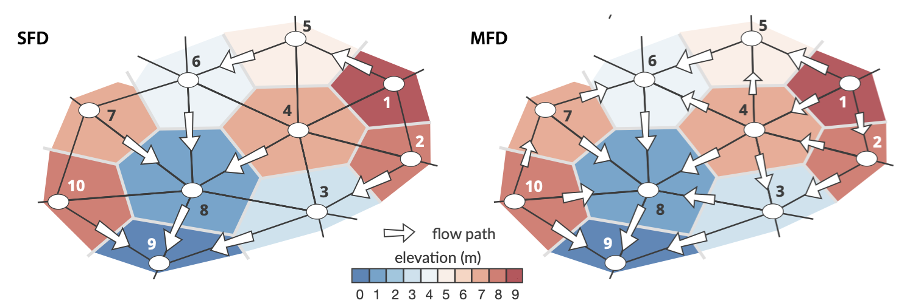

.. _flow:

=========================
River Discharge
=========================

Flow accumulation
------------------------------------

Flow accumulation (FA) calculations are core component of landscape evolution models as they are often used as proxy to estimate flow discharge, sediment load, river width, bedrock erosion as well as sediment deposition.

.. note::

  Until recently conventional FA algorithms were **serial** and limited to small spatial problems. With ever growing high resolution digital elevation dataset, new methods based on **parallel** approaches have been proposed over the last decade.

In addition, nearly all of these parallel approaches assume a **single flow direction** (SFD).  This assumption makes the emergent flow network highly sensitive to the underlying mesh geometry and most dendritic shape of obtained stream networks is often an artefact of the surface triangulation. To reduce this effect, authors have proposed to consider not only the steepest downhill direction but also to represent other directions appropriately weighted by slope (**multiple flow direction** - MFD).  Using MFD algorithms prevent locking of erosion pathways along a single direction and help to route flow over flat regions into multiple branches.

   Schematic diagram showing flow paths when considering a triangular irregular network composed of 10 vertices (node IDs are given for each case). Cells (*i.e.* voronoi area defining the region of influence of each vertex) are coloured by elevation. Two cases are presented considering single flow direction (left -- SFD) and multiple flow direction (right -- MFD). White arrows indicate flow direction and their sizes vary in proportion to slope (not at scale). Nodes numbers correspond to the subscripts in equations defined below.

Single and multiple flow directions
------------------------------------

goSPL allows for both SFD and MFD routing by using an adapted version of the parallel implicit drainage area (IDA) method from `Richardson et al. (2014) <https://agupubs.onlinelibrary.wiley.com/doi/full/10.1002/2013WR014326>`_  to unstructured meshes. It consists in writing the FA calculation as a *sparse matrix system of linear equations* and takes full advantage of purpose-built, efficient linear algebra routines available in `PETSc <https://www.mcs.anl.gov/petsc/>`_.

The river discharge is computed from the calculated FA and the net precipitation rate :math:`\mathrm{P}`.
At node :math:`\mathrm{i}`, the river discharge (:math:`\mathrm{q_i}`) is determined as follows:

.. math::

  \mathrm{q_i} = \mathrm{b_i} + \mathrm{\sum_{d=1}^{N_d} q_d}

where :math:`\mathrm{b_i}` is the local volume of water :math:`\mathrm{\Omega_i P_i}` where :math:`\mathrm{\Omega_i}` is the voronoi area and :math:`\mathrm{P_i}` the local precipitation value available for runoff during a given time step. :math:`\mathrm{N_d}` is the number of donors with a donor defined as a node that drains into :math:`\mathrm{i}` (as an example the donor of vertex 5 in the SFD sketch in the above figure is 1). To find the donors of each node, the method consists in finding their receivers first. Then, the receivers of each donor is saved into a receiver matrix, noting that the nodes, which are local minima, are their own receivers.

The transpose of the matrix is then used to get the donor matrix. When the previous equation is applied to all nodes and considering the MFD case illustrated above, the following relations are obtained:

.. math::

  \mathrm{q_1} &= \mathrm{b_1} \\
  \mathrm{q_2} &= \mathrm{b_2 + q_1 w_{1,2}}  \\
  \mathrm{q_3} &= \mathrm{b_3 + q_2 w_{2,3} + q_4 w_{4,3} } \\
  \mathrm{q_4} &= \mathrm{b_4 +  q_1 w_{1,4} + q_2 w_{2,4}}  \\
  \mathrm{q_5} &= \mathrm{b_5 + q_1 w_{1,5} + q_4 w_{4,5}} \\
  \mathrm{q_6} &= \mathrm{b_6 + q_4 w_{4,6} + q_5 w_{5,6} + q_7 w_{7,6}}  \\
  \mathrm{q_7} &= \mathrm{b_7 + q_{10} w_{10,7}} \\
  \mathrm{q_8} &= \mathrm{b_8 + q_3 w_{3,8} + q_4 w_{4,8} + q_6 w_{6,8} + q_7 w_{7,8} + q_{10} w_{10,8}}\\
  \mathrm{q_9} &= \mathrm{b_9 + q_3 w_{3,9} + q_8 w_{8,9} + q_{10} w_{10,9}}

The choice of weights :math:`\mathrm{w_{m,n}}` depends on the number of flow directions that is used. The weights range between zero and one and sum to one for each node:

.. math::

  \mathrm{\sum_n w_{m,n}} = 1

The number of flow direction paths is user-defined and can vary from 1 (*i.e.* SFD) up to 6 (*i.e.* MFD) depending of the grid neighbourhood complexity. The weights are calculated based on the number of downslope neighbours and are proportional to the slope.

Linear solver
---------------

In matrix form the system defined above  is equivalent to **W q** = **b** or:

.. math::
  \begin{align}
  \begin{bmatrix}
      1 & & & & & & & & & \\
       \mathrm{-w_{1,2}} & 1 & & & & & & & & \\
       &  \mathrm{-w_{2,3}} & 1 & \mathrm{-w_{4,3}} & & & & & & \\
       \mathrm{-w_{1,4}} &  \mathrm{-w_{2,4}} & & 1 & & & & & & \\
       \mathrm{-w_{1,5}} &  & & \mathrm{-w_{4,5}} & 1 & & & & & \\
       & & & \mathrm{-w_{4,6}} & \mathrm{-w_{5,6}} & 1 & \mathrm{-w_{7,6}} & & & \\
       & & & & & & 1 & & & \mathrm{-w_{10,7}}\\
       & & \mathrm{-w_{3,8}} & \mathrm{-w_{4,8}} & & \mathrm{-w_{6,8}} & \mathrm{-w_{7,8}} & 1 & & \mathrm{-w_{10,8}} \\
       & & \mathrm{-w_{3,9}} & & & & & \mathrm{-w_{8,9}} & 1 & \mathrm{-w_{10,9}} \\
       & & & & & & & & & 1
  \end{bmatrix}
   \begin{bmatrix}
      \mathrm{q_1} \\
      \mathrm{q_2} \\
      \mathrm{q_3} \\
      \mathrm{q_4} \\
      \mathrm{q_5} \\
      \mathrm{q_6} \\
      \mathrm{q_7} \\
      \mathrm{q_8} \\
      \mathrm{q_9} \\
      \mathrm{q_{10}}
  \end{bmatrix}
  =  \begin{bmatrix}
      \mathrm{b_1} \\
      \mathrm{b_2} \\
      \mathrm{b_3} \\
      \mathrm{b_4} \\
      \mathrm{b_5} \\
      \mathrm{b_6} \\
      \mathrm{b_7} \\
      \mathrm{b_8} \\
      \mathrm{b_9} \\
      \mathrm{b_{10}}
  \end{bmatrix}
  \end{align}

The vector **q** corresponds to the unknown river discharge (volume of water flowing on a given node per year) and the elements of **W** left blank are zeros.

.. note::

  As explained in `Richardson et al. (2014) <https://agupubs.onlinelibrary.wiley.com/doi/full/10.1002/2013WR014326>`_, the above system is implicit as the river discharge for a given vertex depends on its neighbours unknown flow discharge. The matrix **W** is sparse and is composed of diagonal terms set to unity (identity matrix) and off-diagonal terms corresponding to at most the immediate neighbours of each vertex (typically lower than 6 in constrained Delaunay triangulation).

In goSPL, this matrix is built in parallel using compressed sparse row matrix functionality available from `SciPy <https://docs.scipy.org/doc/scipy/reference/generated/scipy.sparse.csr_matrix.html>`_.

Once the matrix has been constructed, `PETSc <https://www.mcs.anl.gov/petsc/>`_ library is used to solve matrices and vectors across the decomposed domain. The performance of the **IDA** algorithm is strongly dependent on the choice of solver and preconditioner. In goSPL, the solution for **q** is obtained using a *flexible GMRES* Krylov solver (``fgmres``) with block Jacobi preconditioning (``bjacobi``). An earlier stationary *Richardson* iteration was found to destabilise at some domain decompositions on the ill-conditioned drainage operator (its per-rank Jacobi blocks differ with the partition), producing erratic, processor-count-dependent run times; the GMRES accelerator converges robustly and consistently across processor counts. The solver and preconditioner can still be overridden at run time through the ``GOSPL_FLOW_KSP`` and ``GOSPL_FLOW_PC`` environment variables if better combinations are found.

Iterative methods allow for an initial guess to be provided. When this initial guess is close to the solution, the number of iterations required for convergence dramatically decreases. This option is used in goSPL by allocation the river discharge solution from previous time step as an initial guess. It allows to decrease the number of iterations of the IDA solver as discharge often exhibits small change between successive time intervals.

.. important::

  The approach presented here is run iteratively during a single time step based on identified depressions until all water *either flows to the ocean or is block within a pit* (*e.g.*, a lake). 
  
  Water is able to spill-over a depression based on depression's volume and the incoming upstream water volume. By default **no infiltration or evaporation is considered** in the routing — unless the optional evaporation forcing (see :ref:`surfproc`) or the :ref:`groundwater module <groundwater>` is enabled, in which case part of the runoff infiltrates and returns downstream as baseflow (see *Coupling with the water table* below).
  
.. note::

  The flow routing approach and corresponding flow CSR matrix (**W**) is also used in the sediment routing algorithm.

When cells cannot be drained at all
------------------------------------

The operator :math:`\mathrm{(I - W^T)}` is singular over any set of cells that has no path out: a near-flat region whose flow-direction tie-break closes a cycle is the usual example, and no solver (Krylov or stationary) can converge there. goSPL localises that region from the residual and decides what to do from its **size**:

* a region **at or below** the un-drained cap is treated as benign. Those cells are **ponded**, that is each keeps its own runoff and passes nothing downstream, the converged discharge everywhere else is kept, and the run continues. On the main discharge solve this prints ``[flow] main discharge solve: N un-drained cell(s) ponded …``.
* a region **above** the cap, or a non-finite right-hand side or matrix, is a genuine failure (a NaN source, a broken partition) and the main discharge solve aborts rather than feed a no-river state into erosion and sediment transport.

The cap defaults to ``max(256, 0.5 % of the mesh)``, which is sized so a knife-edge micro-cycle ponds while a real breakdown still stops the run. It can be raised with the ``GOSPL_UNDRAINED_CAP`` environment variable, either as a **fraction** of the mesh (a value below 1, e.g. ``0.02`` for 2 %) or as an **absolute node count** (``100000``):

.. code-block:: bash

    GOSPL_UNDRAINED_CAP=0.02 mpirun -np 144 gospl -i input.yml -v

(the full list of solver escape hatches is in :ref:`running`). Raise it deliberately, when you know the region concerned is a wide, genuinely closed basin that should pond: at fine resolution a large endorheic interior can make the operator singular over far more cells than the default cap allows, and ponding it is the physically correct outcome. It cannot mask a corrupt state, because a non-finite right-hand side or matrix aborts at any cap. Note that the node index quoted in the failure message is PETSc's global numbering, which depends on the partition, so it cannot be looked up directly in the input mesh file.

Before raising the cap it is worth knowing whether the region is real physiography or a defect in the input topography, such as a large flat patch left by a NODATA fill or by quantised elevations. Cells with no strictly lower neighbour are what seed the flat routing that closes these cycles, and ``scripts/fill_mesh_pits.py --check`` counts them on the input mesh in a single pass (see :ref:`fillpits`). A count in the tens of thousands points at the topography; a handful points at the solver edge case the cap is there to absorb. If it is the topography, that tool can fill the artefacts while leaving the genuine basins alone (``--max-depth`` / ``--max-volume`` / ``--max-cells``), which addresses the cause rather than widening the tolerance. Note that a filled flat drains in geometric bands unless the fill gradient is reshaped, which is what its ``--flat-resolve`` option does; see :ref:`fillpits`.

When the overspill iteration stops
----------------------------------

Each pass of that iteration rebuilds the flow matrix on the updated water surface and re-solves the system, so the number of passes drives the cost of the flow phase. goSPL therefore watches the residual downstream flux (the water still waiting to be routed) and stops on whichever of these comes first:

* **Converged**: the residual has fallen below a small fraction of its value on the first pass (``GOSPL_CASCADE_REL_FLOOR``, default :math:`\mathrm{10^{-3}}`; set it to ``0`` to disable). What remains is a trickle whose routing would cost a full matrix rebuild and solve per pass, so it is left ponded. This is the normal outcome and is reported only in verbose mode as ``[flow] downstream cascade complete after N passes …``.
* **Un-drainable**: the residual has stopped shrinking altogether for several consecutive passes (``GOSPL_CASCADE_PATIENCE``, default 3). The remaining water sits in a depression that has no path out on this decomposition, which is physically a closed basin, so it is left ponded and a ``[flow] downstream cascade stalled after N passes …`` warning is printed. A hard cap (``GOSPL_CASCADE_MAX_STEPS``, default 100) is a final backstop.

.. warning::

  A *stalled* message is worth investigating when the depression involved should physically drain, because the water it ponds never reaches the downstream network. The usual cause is a wide, nearly flat pocket only a metre or two above its outlet: the depression-filling step then produces a flat water surface on which the spill point's flow directions can point back into the pocket itself. Such a feature is a property of the **input topography** rather than of the solver (the residual is identical whichever Krylov solver is used), and it is best removed by conditioning the DEM, carving a gently descending channel from the pocket to its outlet, rather than by loosening the thresholds above. The ``scripts/fill_mesh_pits.py`` helper does this over the whole input mesh in one pass (see :ref:`fillpits`); note that it raises the pocket to its spill level instead of carving a channel, so it changes the initial elevation. A deep interior basin, by contrast, is genuinely endorheic and *should* pond.

Coupling with glacial meltwater
-------------------------------

When the ice module is enabled, the source term :math:`\mathrm{b_i}` is *not* simply the local precipitation. Cells above the equilibrium-line altitude (ELA) divert a fraction of their precipitation into the ice accumulator (see :ref:`ice`), and cells below the ELA that hold ice receive the corresponding ablation rate back as liquid water. Concretely, before solving for **q** goSPL replaces:

.. math::

  \mathrm{b_i} \rightarrow \mathrm{b_i \cdot (1 - r_i^{ice}/P_i) + m_i}

Coupling with the water table (baseflow)
----------------------------------------

When the optional :ref:`groundwater module <groundwater>` is enabled, part of the
runoff **infiltrates** instead of flowing overland and re-emerges downstream as
**baseflow**. With ``conserve_baseflow`` on, before solving for **q** goSPL
replaces the runoff source with

.. math::

  \mathrm{b_i} \rightarrow \mathrm{b_i} - \mathrm{R_i A_i} + \mathrm{Q_i^{seep}}

where :math:`\mathrm{R_i}` is the net groundwater recharge (m/yr), :math:`\mathrm{A_i}`
the cell area, and :math:`\mathrm{Q_i^{seep}}` the seepage discharge returned by the
water-table solve at the seepage nodes. The exchange is **net-neutral globally**
(:math:`\sum \mathrm{Q^{seep}} \approx \sum \mathrm{R\,A}`), so total river discharge
stays :math:`\approx` rain − evap, but it is spatially redistributed — discharge
moves from the recharge uplands to the springs and valleys where the water table
meets the surface, making rivers **baseflow-fed**. See :ref:`groundwater` for the
Dupuit–Boussinesq head solve that produces :math:`\mathrm{Q^{seep}}`.

where :math:`\mathrm{r_i^{ice}}` is the ice-accumulation rate and :math:`\mathrm{m_i}` is the meltwater rate produced where ice exists below the ELA. This keeps glacier-fed rivers from under-predicting discharge downstream of melt zones.