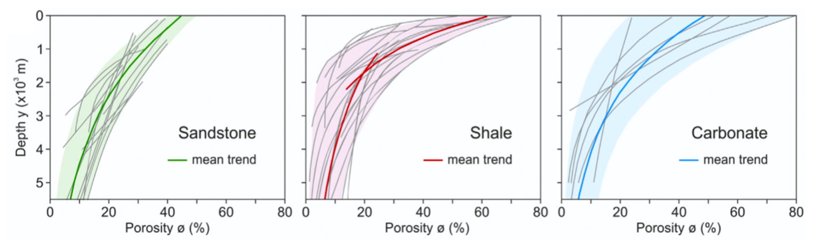

.. _strat:

==============================================
Stratigraphy and compaction
==============================================

Stratigraphic record
-----------------------

.. note::

  Stratigraphic architecture records surface evolution history from sediment production in the continental domain to its transport and deposition to the marine realm. To interpret stratigraphic architecture, goSPL integrates the complete source-to-sink system: river erosion, sediment transport and deposition.

When the stratigraphic record option is turned on in goSPL, stratigraphic layers are defined locally on each partition and for each nodes and consist in the following information:

- elevation at time of deposition,
- thickness of each stratigraphic layer, and
- porosity of sediment in each stratigraphic layer computed at centre of each layer.

When stratigrapht is activated in goSPL, the erosion, transport and deposition are recorded at any given time steps. This requires to keep track of all layers previously deposited. In this case, several assumptions are made. **First**, the model assumes that the volume of rock eroded using the :ref:`stream power law <ero>` accounts for both the solid and void phase. **Second**, the volume of eroded material corresponds to the solid phase only and has the same composition as the eroded stratigraphic layers. 

Inland deposits thicknesses and composition are then updated and recorded in the top stratigraphic layer and the porosities are set to the uncompacted sediment value.

Porosity and compaction
-------------------------

To properly simulate stratigraphic evolution, sediment compaction is also considered in goSPL as it modifies the geometry and the properties of the deposits.

Sediments compaction is assumed to be dependent of deposition rate and porosity :math:`\mathrm{\phi}` is considered to varies with depth :math:`\mathrm{z}` following the formulation proposed by `Sclater and Christie, 1980 <https://agupubs.onlinelibrary.wiley.com/doi/10.1029/JB085iB07p03711>`_ based on many sedimentary basins observations:

.. math::

    \mathrm{\phi(z)} = \mathrm{\phi_0 e^{-z/z_0}}

where :math:`\mathrm{\phi_0}` is the surface porosity of sediments, and :math:`\mathrm{z_0}` is the e-folding sediment thickness for porosity reduction.

  Compilation plots of published compaction trends (grey lines) of sandstone, shale, carbonate (from Lee et al., 2020). The mean trend of each plot is defined by exponential function. A set of two exponential curves is applied to shale to fit better the underlying range.

As shown in the figure above, porosity decreases for burial depth of the order of a few thousand meters (:math:`\mathrm{z_0}`), accordingly associated compaction increases substantially (`Sclater and Christie, 1980 <https://agupubs.onlinelibrary.wiley.com/doi/10.1029/JB085iB07p03711>`_). We can also see that the porosity and rate of compaction between fine and coarse sediments are significantly different. As a result, goSPL uses the proportion of coarse versus fine at all depths within the underlying stratigraphy column to properly estimate compaction and induced elevation changes.

For a given stratigraphic layer :math:`\mathrm{i}`, the associated porosity is obtained at the centre of the layer for a specific depth :math:`\mathrm{\bar{z}_i}` by:

.. math::

    \mathrm{\phi_1(\mathrm{\bar{z}_i})} = \mathrm{\phi_{0} e^{-\mathrm{\bar{z}_i}/z_{0}}} 
    

At a given time :math:`\mathrm{k}` after :math:`\mathrm{i}`, the layer centre depth is defined by:

.. math::

    \mathrm{\bar{z}_i} = \mathrm{\sum_{j=i+1}^{k} \Delta z_j^{k} + \Delta z_i^{k} / 2}

where the thickness of that layer :math:`\mathrm{\Delta z_i^{k}}` is related to the amount of solid material deposited in the layer :math:`\mathrm{\Delta h_{S,i}}` by the following relationship:

.. math::

    \mathrm{\Delta z_i^{k} [(1-\phi_1(\bar{z}_i))]} = \mathrm{\Delta h_{S,i}}

The values of :math:`\mathrm{\Delta z_i^{k}}` for :math:`\mathrm{i=1,...,k}` are then computed sequentially from the top to the bottom of the sedimentary pile.

Sedimentary layer elevation is then decreased based on the sum of compaction happening in each layer between two consecutive time steps.
