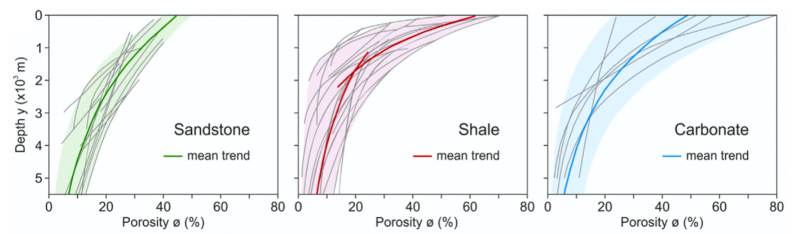

.. _strat:

==============================================
Stratigraphy and compaction
==============================================

Stratigraphic record
-----------------------

.. note::

  Stratigraphic architecture records surface evolution history from sediment production in the continental domain to its transport and deposition to the marine realm. To interpret stratigraphic architecture, goSPL integrates the complete source-to-sink system: river erosion, sediment transport and deposition.

When the stratigraphic record option is turned on in goSPL, stratigraphic layers are defined locally on each partition and for each nodes and consist in the following information:

- elevation at time of deposition,
- thickness of each stratigraphic layer, and
- porosity of sediment in each stratigraphic layer computed at centre of each layer.

When stratigrapht is activated in goSPL, the erosion, transport and deposition are recorded at any given time steps. This requires to keep track of all layers previously deposited. In this case, several assumptions are made. **First**, the model assumes that the volume of rock eroded using the :ref:`stream power law <ero>` accounts for both the solid and void phase. **Second**, the volume of eroded material corresponds to the solid phase only and has the same composition as the eroded stratigraphic layers. 

Inland deposits thicknesses and composition are then updated and recorded in the top stratigraphic layer and the porosities are set to the uncompacted sediment value.

Porosity and compaction
-------------------------

To properly simulate stratigraphic evolution, sediment compaction is also considered in goSPL as it modifies the geometry and the properties of the deposits.

Sediments compaction is assumed to be dependent of deposition rate and porosity :math:`\mathrm{\phi}` is considered to varies with depth :math:`\mathrm{z}` following the formulation proposed by `Sclater and Christie, 1980 <https://agupubs.onlinelibrary.wiley.com/doi/10.1029/JB085iB07p03711>`_ based on many sedimentary basins observations:

.. math::

    \mathrm{\phi(z)} = \mathrm{\phi_0 e^{-z/z_0}}

where :math:`\mathrm{\phi_0}` is the surface porosity of sediments, and :math:`\mathrm{z_0}` is the e-folding sediment thickness for porosity reduction.

  Compilation plots of published compaction trends (grey lines) of sandstone, shale, carbonate (from Lee et al., 2020). The mean trend of each plot is defined by exponential function. A set of two exponential curves is applied to shale to fit better the underlying range.

As shown in the figure above, porosity decreases for burial depth of the order of a few thousand meters (:math:`\mathrm{z_0}`), accordingly associated compaction increases substantially (`Sclater and Christie, 1980 <https://agupubs.onlinelibrary.wiley.com/doi/10.1029/JB085iB07p03711>`_). We can also see that the porosity and rate of compaction between fine and coarse sediments are significantly different. As a result, goSPL uses the proportion of coarse versus fine at all depths within the underlying stratigraphy column to properly estimate compaction and induced elevation changes.

For a given stratigraphic layer :math:`\mathrm{i}`, the associated porosity is obtained at the centre of the layer for a specific depth :math:`\mathrm{\bar{z}_i}` by:

.. math::

    \mathrm{\phi_1(\mathrm{\bar{z}_i})} = \mathrm{\phi_{0} e^{-\mathrm{\bar{z}_i}/z_{0}}} 
    

At a given time :math:`\mathrm{k}` after :math:`\mathrm{i}`, the layer centre depth is defined by:

.. math::

    \mathrm{\bar{z}_i} = \mathrm{\sum_{j=i+1}^{k} \Delta z_j^{k} + \Delta z_i^{k} / 2}

where the thickness of that layer :math:`\mathrm{\Delta z_i^{k}}` is related to the amount of solid material deposited in the layer :math:`\mathrm{\Delta h_{S,i}}` by the following relationship:

.. math::

    \mathrm{\Delta z_i^{k} [(1-\phi_1(\bar{z}_i))]} = \mathrm{\Delta h_{S,i}}

The values of :math:`\mathrm{\Delta z_i^{k}}` for :math:`\mathrm{i=1,...,k}` are then computed sequentially from the top to the bottom of the sedimentary pile.

Sedimentary layer elevation is then decreased based on the sum of compaction happening in each layer between two consecutive time steps.

Bedrock sentinel
^^^^^^^^^^^^^^^^

When no initial stratigraphy file (``npstrata``) is provided, goSPL treats stratigraphic layer 0 as an effectively infinite bedrock reservoir by initialising its thickness to a sentinel value of :math:`\mathrm{10^6}` m. The erosion logic adds and subtracts this offset internally so it cancels out of all eroded-volume calculations.

The compaction step explicitly **freezes** the sentinel layer: when ``bedrockLay > 0`` (set to ``1`` for the no-file case and ``0`` when an initial stratigraphy file is loaded), the corresponding rows of :math:`\mathrm{\Delta z}` and :math:`\mathrm{\phi}` are restored to their pre-compaction values at the end of ``_depthPorosity``. Without this, the sentinel would compute a near-zero equilibrium porosity at the resulting half-million-metre burial depth and shrink to roughly half its thickness in a single step, producing a catastrophic surface drop.

Porosity inheritance for empty layers
^^^^^^^^^^^^^^^^^^^^^^^^^^^^^^^^^^^^^

Stratigraphic layers can become *empty* between erosion and the next deposition window — their thickness is set to zero and their porosity is cleared. To keep the output porosity field continuous (and to avoid spurious zero values in compaction calculations on subsequent steps), zero-thickness layers inherit the porosity of the nearest underlying layer with non-zero porosity. The fill is a vectorised forward-fill along the layer axis:

.. math::

   \mathrm{\phi_k \leftarrow \phi_j,\quad j = \max\{m < k : \phi_m > 0\}}

with the convention that leading zeros at the column base (no valid layer below) remain zero. This is applied both at the end of ``_depthPorosity`` (after compaction) and at the end of ``erodeStrat`` (after erosion).

Per-layer erodibility multiplier
^^^^^^^^^^^^^^^^^^^^^^^^^^^^^^^^

For runs initialised from an ``npstrata`` file, goSPL accepts an optional ``stratK`` field of shape ``(mesh_points, initial_layers)`` containing a **per-layer multiplier** applied to the SPL erodibility coefficient. The effective per-node erodibility seen by the stream-power law becomes

.. math::

   \mathrm{K_{eff}(i)} = \mathrm{K \cdot s_K(i) \cdot f_{sed}(i) \cdot P_i^{\,d}}

where :math:`\mathrm{K}` is the scalar value declared in the YAML ``spl`` block, :math:`\mathrm{s_K(i)}` is the multiplier read from the topmost non-empty layer in node :math:`i`'s stratigraphic column, :math:`\mathrm{f_{sed}(i)}` is the optional ``sedfactor`` map, and :math:`\mathrm{P_i^{\,d}}` is the precipitation-dependent term controlled by the YAML ``spl.d`` exponent.

The multiplier is stored as ``self.stratK[lpoints, stratNb]`` parallel to ``stratH`` / ``phiS``, with these conventions:

- **Initial layers**: read directly from the ``stratK`` key of the ``npstrata`` file. If the key is absent, all initial layers default to ``1.0`` (no scaling).
- **Bedrock sentinel** (no ``npstrata`` file): layer 0 defaults to ``1.0`` so the SPL falls back to the YAML-default :math:`\mathrm{K}`.
- **Freshly deposited layers**: ``stratK`` is reset to ``1.0``. Material eroded from a bedrock layer and re-deposited downstream therefore loses the bedrock-specific multiplier — physically, the rock has been broken into sediment and no longer carries its original resistance.
- **Emptied layers**: ``stratK`` is cleared to zero alongside ``stratH`` / ``phiS`` and then forward-filled from the nearest non-empty layer below, so a partially-exhumed column always exposes a real bedrock multiplier at the surface.

The lookup of the surface multiplier is a vectorised search for the highest non-zero layer index per node, performed once per SPL evaluation. When stratigraphy is disabled (``stratNb == 0``) or the column is fully empty, the helper returns ``1.0`` and the SPL behaviour is identical to a run without ``stratK``.

.. note::

   The per-layer multiplier is currently a **single value per layer** and applies only to the bedrock SPL coefficient. It is not available in the dual coarse/fine sediment configuration, and it does not scale the soil-layer erodibility ``Ksoil`` in the soil-coupled SPL flavour.
