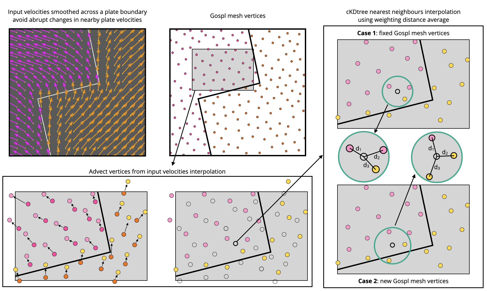
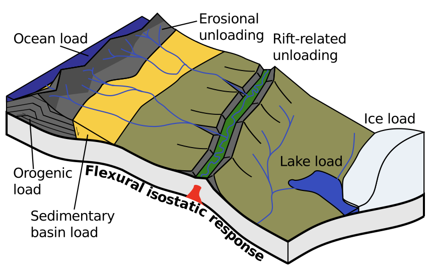

.. _tecto:

.. role:: yaml(code)
   :language: yaml

==================================
Tectonic forcing
==================================

.. note::

  These forcing are user defined and could be either lithospheric or mantle induced but goSPL does not know which underlying process is inducing these changes and does not account for sediments and crust compression.

Uplift & subsidence
---------------------------------

In the most simple case of vertical-only displacements (*i.e.* uplift or subsidence), the model requires the declaration of successive events using :yaml:`start`, :yaml:`end` times and the tectonic rates map :yaml:`mapV` (in metres per year). This map is defined prior to the model run for goSPL spherical mesh as a  numpy zip array.

During the model run and for each time step, the prescribed rates are applied on all vertices of all partition by increasing or decreasing their elevation values following imposed local subsidence or uplift rates.

For particular experiments, where goSPL is ran in **forcing paleo-topography** mode and for specified time intervals, simulated elevations are compared with user defined paleo-topography ones. The differences are then converted as a vertical displacement field. Then the simulation is reinitialised to the previous comparison time and reran forward adding this new vertical displacements field to the one already existing for this previous timeframe. This approach allows to force the model with available paleo-topographies while allowing erosion, deposition and hillslope processes to act upon the surface based on the changing tectonic conditions.

Horizontal advection
---------------------------------

The second, more complex, option consists in adding horizontal displacements (:yaml:`mapH`). In this case, the user has to defined for each point of the grid the associated spherical velocities (represented by displacement fields in both X,Y and Z coordinates) and advection is performed using a **semi-lagrangian scheme**.

Considering the spatial resolution of goSPL mesh (above 5 km), the horizontal advection often corresponds to plate motions and can be obtained from plate-tectonic reconstruction software.

.. warning::

  Compared to vertical displacements applied at each time step, the horizontal advection is only performed at specific intervals (of the order of several thousands to millions years) specified in the goSPL input file by the :yaml:`tec` parameter in the :yaml:`time` section.

  Illustration of interpolation between mesh vertices induced by horizontal velocities based on a semi-lagrangian scheme.

Due to tectonic advection, the density of the surface nodes evolves over time, which leads to areas showing rarefaction or accumulation of nodes. In order for the finite volume schema to remain accurate, local addition and deletion of nodes and remeshing of the triangulated spherical surface are therefore required. However, the remeshing process is computationally expensive and requires to rebuild not only the delaunay mesh but also the associated voronoi one and to redistribute, balance the mesh and its vertices parameters with `PETSc <https://www.mcs.anl.gov/petsc/>`_.

Two options are proposed to deal with vertices advection in goSPL.

In the first one and to avoid remeshing, the initial mesh is assumed to remain fixed and the advected points are then used to interpolate the advected nodes informations (elevation, erosion, deposition, stratigraphic information...) onto the fixed ones using an inverse weighting distance approach and `SciPy cKDTree <https://docs.scipy.org/doc/scipy/reference/generated/scipy.spatial.cKDTree.html>`_. The number of points used for the interpolation is defined by the user in the input file (:yaml:`interp` field). An example based on this option is provided in the User Guide - `backward forward <https://gospl.readthedocs.io/en/latest/user_guide/bfModel/bfModel.html>`_ example. In this version, a unique number of points is given for the interpolation but we plan to make it spatially varying to avoid *over-smoothing* node parameters in specific regions (such as subduction zones).

The second option is much slower as it involves creating a completely new mesh every time the horizontal advection is applied. This new mesh is then used to perform the interpolation strategy presented above. Disregarding the chosen method, the interpolation will always *smooth* the nodes parameters. This second option however allows to use unstructured spherical mesh with refined regions that will retain their resolution as the plates motion is applied. In its current form goSPL uses `JIGSAW <https://github.com/dengwirda/jigsaw-python>`_ to perform the refinement based on elevation range. We chose an elevation-based refinement approach with higher resolutions on the terrestrial and shelf domain as our focus is on rivers network, drainage basin reorganisation and deltaic systems representation. An example of the approach used in this case is provided in the User Guide :ref:`Remeshing Workflow <advance>` section.

For regions of diverging or converging lateral movement, the elevation and stratigraphic information are first interpolated based on previous time step, and then uplift and subsidence are applied. In this sense the vertical and horizontal movement of the surface is performed *kinematically* at each time step, and subsequent erosion and deposition occuring on the modified surface lead to an update in elevation and stratigraphy information.

.. note::

  Additional constrained for mesh refinement can be set if needed. As an example, one can use the horizontal velocity field magnitude as a parameter for refinement and create meshes with higher resolutions for regions with higher magnitudes in order to better represent the deformation in these areas.

Flexural isostasy
---------------------------------

  Flexural isostasy can be produced in response to a range of geological loads (from `Wickert, 2016 <https://gmd.copernicus.org/articles/9/997/2016/gmd-9-997-2016.pdf>`_).

When running goSPL in 2D (*i.e.* not at global scale), it is possible to compute the flexural isostasy equilibrium based on topographic change. The function accounts for flexural isostatic rebound associated with erosional loading/unloading.

It takes an initial (at time :math:`t`) and final topography (at time :math:`D + \Delta t`) (*i.e.* before and after erosion/deposition) and returns a corrected final topography that includes the effect of erosional/depositional unloading/loading. 

The approach relies on a spectral method to solve the bi-harmonic equation governing the bending/flexure of a thin elastic plate floating on an inviscid fluid (the asthenosphere).

.. math::

  D \frac{d^4 w}{d^4 x} + \Delta \rho g w = q

where :math:`D` is the flexural rigidity,  :math:`w` is vertical deflection of the plate, :math:`q` is the applied surface load, and :math:`\Delta \rho = \rho_m − \rho_f` is the density of the mantle minus the density of the infilling material.

