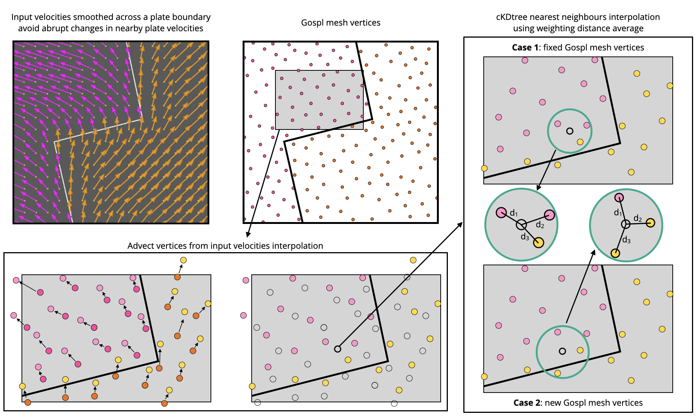
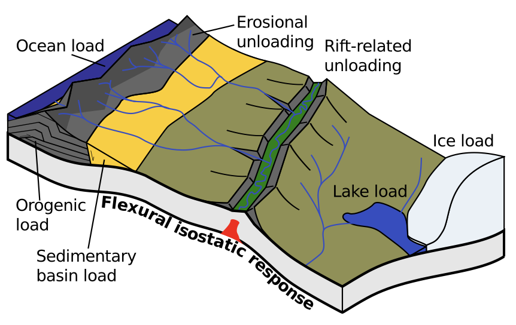

.. _tecto:

.. role:: yaml(code)
   :language: yaml

==================================
Tectonic forcing
==================================

.. note::

  These forcing are user defined and could be either lithospheric or mantle induced but goSPL does not know which underlying process is inducing these changes and does not account for sediments and crust compression.

Uplift & subsidence
---------------------------------

In the most simple case of vertical-only displacements (*i.e.* uplift or subsidence), the model requires the declaration of successive events using :yaml:`start`, :yaml:`end` times and the tectonic rates map :yaml:`upsub` (in metres per year). This map is defined prior to the model run for goSPL spherical or 2D mesh as a  numpy zip array.

During the model run and for each time step, the prescribed rates are applied on all vertices of all partition by increasing or decreasing their elevation values following imposed local subsidence or uplift rates.

Horizontal advection
---------------------------------

The second, more complex, option consists in adding horizontal displacements (:yaml:`hdisp`). In this case, the user has to defined for each point of the grid the associated velocities (represented by displacement fields in both X,Y and Z coordinates) and advection could be performed based on different techniques.

Using **Upwind** or **IIOE scheme**
^^^^^^^^^^^^^^^^^^^^^^^^^^^^^^^^^^^^^^

.. important::
  
  These two approaches are designed for 2D meshes and have not been tested on global simulations.

The Upwind scheme offers a rapid solution to the advection problem but with potentially excessive diffusion when solved implicitly (`first-order upwind implicitly scheme <https://www.sciencedirect.com/science/article/pii/S0168927414001032>`_).

Alternatively, the user can perform the advection of elevation and erosion by solving the advection equation based on a finite volume space discretization and a semi-implicit discretization in time called the Inflow-Implicit/Outflow-Explicit scheme and following the work from `Mikula & Ohlberger, 2014 <https://www.math.sk/mikula/mo-FVCA6.pdf>`_. 

Setting the approach for a given simulation is done in the input file by setting the `advect` key to either `upwind`, `iioe1` or `iioe2`.

.. note::

    In the IIOE approach, the outflow from a cell is treated explicitly while inflow is treated implicitly.

    Since the matrix of the system is determined by the inflow fluxes it is an M-matrix yielding favourable solvability and stability properties.

Both methods allow large time steps without losing stability and not deteriorating precision.

The IIOE is formally second order accurate in space and time for 1D advection problems with variable velocity and numerical experiments indicate its second order accuracy for smooth solutions in general.

.. note::

    **Cyclic (periodic) boundaries.** Horizontal advection works with a cyclic boundary (a periodic 2D model runs on a cylinder mesh). The displacement field is still given in the flat ``(vx, vy)`` frame; goSPL maps it onto the cylinder tangent so the periodic-axis component advects *around* the seam. The finite-volume advection then transports material across the periodic boundary through the wrapping cells (the seam is not pinned), so it remains mass-conserving across the seam.

.. note::

    Velocity at the face is taken to be the linear interpolation for each vertex (in a vertex-centered discretisation the dual of the delaunay triangulation (i.e. the voronoi mesh has its edges on the middle of the nodes edges)).

    Similarly we consider that the advected variable at the face is defined by linear interpolation from each connected vertex.

Two IOOE schemes are available the first one (`iooe1`)
uses the technique defined `here <https://www.math.sk/mikula/mo-FVCA6.pdf>`_, the second (`iooe2`) is more computationally demanding but should limit instabilities in regions with large advection velocities (see `paper <https://www.sciencedirect.com/science/article/pii/S0168927414001032>`_).

Using the **semi-lagrangian scheme**
^^^^^^^^^^^^^^^^^^^^^^^^^^^^^^^^^^^^^^

Used for global mesh, the horizontal advection (advect: `interp`) often corresponds to plate motions and can be obtained from plate-tectonic reconstruction software.

.. warning::

  Compared to vertical displacements applied at each time step, the horizontal advection for this method is only performed at the end of the specified tectonic interval (so usually of the order of several thousands to millions years). 

  Illustration of interpolation between mesh vertices induced by horizontal velocities based on a semi-lagrangian scheme.

.. note::
  
  Due to tectonic advection, the density of the surface nodes evolves over time, which leads to areas showing rarefaction or accumulation of nodes. In order for the finite volume scheme to remain accurate, local addition and deletion of nodes and remeshing of the triangulated spherical surface are therefore required. However, the remeshing process is computationally expensive and requires to rebuild not only the delaunay mesh but also the associated voronoi one and to redistribute the mesh and its vertices parameters with `PETSc <https://www.mcs.anl.gov/petsc/>`_.

  To avoid remeshing, the initial mesh is assumed to remain fixed and the advected points are then used to interpolate the advected nodes informations (elevation, erosion, deposition, stratigraphic information...) onto the fixed ones using an inverse weighting distance approach and `SciPy cKDTree <https://docs.scipy.org/doc/scipy/reference/generated/scipy.spatial.cKDTree.html>`_. The number of points used for the interpolation is defined by the user in the input file (:yaml:`interp` field). This is an efficient approach but it might not be the most accurate one.

Flexural isostasy
---------------------------------

goSPL provides two flexural-isostasy solvers, selected by ``flexure: method``: a **parallel finite-volume biharmonic** solve performed directly on the unstructured mesh for 2D simulations (``'fem'``), and a **spherical-harmonic** solve for global (sphere) simulations (``'global'``). Neither uses a regular grid for the flexure itself — the 2D solve works node-by-node on the mesh, and the global solve works in the spherical-harmonic domain.

  Flexural isostasy can be produced in response to a range of geological loads (from `Wickert, 2016 <https://gmd.copernicus.org/articles/9/997/2016/gmd-9-997-2016.pdf>`_).

Flexural isostasy for 2D simulations
^^^^^^^^^^^^^^^^^^^^^^^^^^^^^^^^^^^^^^

When running goSPL in 2D, it is possible to compute the flexural isostasy equilibrium based on topographic change. The function accounts for flexural isostatic rebound associated with erosional loading/unloading by solving the thin-elastic-plate biharmonic equation with a parallel finite-volume scheme directly on the unstructured mesh (``flexure: method: 'fem'``), supporting spatially-variable elastic thickness.

.. note::

  The 2D solve runs **in parallel** directly on the mesh (no gather-to-root, no regular grid) and caches its operator and factorisation across time steps — only the surface load changes between steps — so it stays fast even on small meshes. Spatially-varying elastic thickness is handled in a single linear solve.

It takes an initial (at time :math:`t`) and final topography (at time :math:`t + \Delta t`) (*i.e.* before and after erosion/deposition) and returns a corrected final topography that includes the effect of erosional/depositional unloading/loading. 

The approach solves the bi-harmonic equation governing the bending/flexure of a thin elastic plate floating on an inviscid fluid (the asthenosphere).

.. math::

  D \frac{d^4 w}{d^4 x} + \Delta \rho g w = q

where :math:`D` is the flexural rigidity,  :math:`w` is vertical deflection of the plate, :math:`q` is the applied surface load, and :math:`\Delta \rho = \rho_m − \rho_f` is the density of the mantle minus the density of the infilling material.

**pyshtools** for global simulations 
^^^^^^^^^^^^^^^^^^^^^^^^^^^^^^^^^^^^^^

When running goSPL in global mode, the flexural isostasy equilibrium is computed based on topographic change using `pyshtools <https://shtools.github.io/SHTOOLS/>`_.

In this case, the global flexural-isostatic response is computed via thin-elastic-shell theory in the spherical-harmonic domain (Turcotte 1979; Willemann & Turcotte 1981).

There are two modes available for the flexural isostasy computation:

1. In the case of a constant Te (scalar ``te``), a single-pass spectral solve is used.
2. In the case of spatially-varying Te (``te``), Picard iteration  with the constant-Te spectral solver as the inner kernel; the rigidity perturbation ``D(x) - D0`` is treated as a spatial correction load that is updated each iteration until self-consistent.

Note that the approximation drops gradient-of-D terms in the elastic operator, so very sharp Te steps may need to be smoothed (e.g. Gaussian with sigma ~ flexural wavelength / 4) before being passed in.