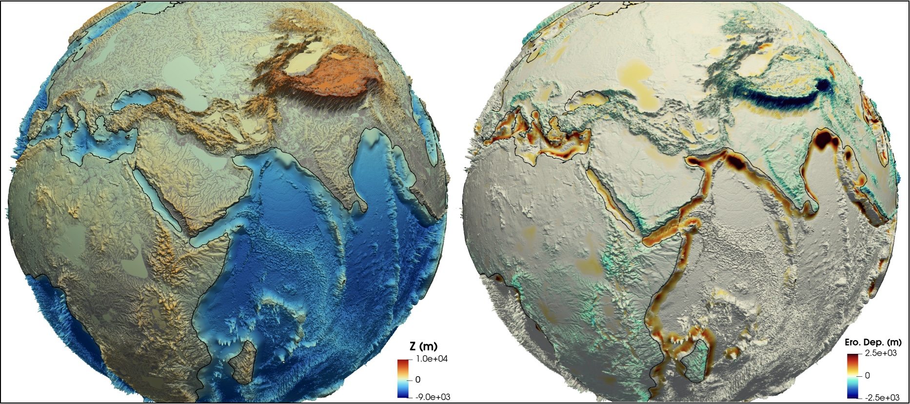
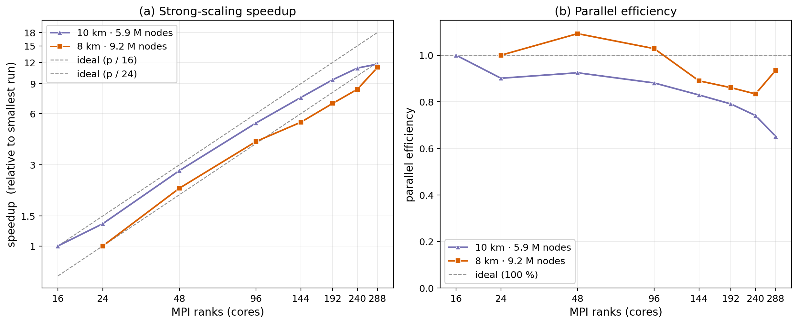
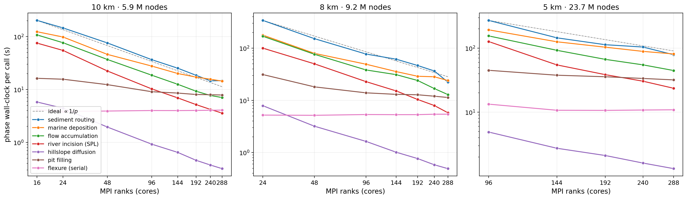

.. _hpc_scaling:

==============================
HPC scaling & performance
==============================

This page reports **honest** strong-scaling measurements for goSPL on
production, global-scale meshes. "Strong scaling" means the *same* problem is
solved on an increasing number of MPI ranks (cores): ideally the wall-clock time
halves when the core count doubles. We report both the **speedup** and the
**parallel efficiency**, and we are explicit about where — and why — efficiency
falls away.

All runs exercise the full model (flow accumulation, river incision/deposition,
continental and marine sediment routing, hillslope diffusion, flexural isostasy,
tectonic forcing) so the numbers reflect a realistic workload, not a single
kernel.

   Example goSPL output on the 10 km global mesh (5.9 M nodes) used for the
   scaling benchmarks below — the full landscape-evolution workload (drainage,
   erosion/deposition, sediment routing) that each timed step solves.

Global mesh resolutions
-----------------------

The benchmarks use three icosahedral-derived global meshes (variable resolution;
the edge lengths below are in km):

.. list-table::
   :header-rows: 1
   :widths: 14 18 18 14 14 14

   * - Cell width (km)
     - Nodes
     - Faces
     - Edge min (km)
     - Edge max (km)
     - Edge mean (km)
   * - 5
     - 23,655,606
     - 47,311,208
     - 3.73
     - 6.78
     - 4.99
   * - 8
     - 9,246,354
     - 18,492,704
     - 6.11
     - 10.96
     - 7.98
   * - 10
     - 5,916,934
     - 11,833,864
     - 7.59
     - 13.61
     - 9.98

How the benchmark is run
------------------------

* **Hardware**: NCI *Gadi* (48-core nodes; counts above 48 span whole nodes).
  The harness lives in ``scripts/scaling/`` (see its ``README.md``); each rank
  count is a separate, optionally chained job (``submit_sweep.sh`` → ``gadi.pbs``).
* **What is timed**: a fixed number of model steps with the wall-clock phase
  profiler enabled and **I/O disabled** (``--io off``), so the numbers reflect
  *compute + communication*, not HDF5 bandwidth.
* **Baseline**: a global mesh is **memory-infeasible at very low core counts**
  (the 10 km mesh needs ~6.6 GB on the heaviest rank and cannot start below
  ~16 ranks; finer meshes need more). There is therefore **no 1-CPU run** to
  normalise against. We follow the standard convention and **baseline to the
  smallest feasible rank count** :math:`p_0` in each sweep:

  .. math::

     S(p) = \frac{T(p_0)}{T(p)}, \qquad E(p) = S(p)\,\frac{p_0}{p}, \qquad
     \text{ideal: } S = p/p_0,\ E = 1.

  When reading the figure, the dashed line is the *ideal* :math:`p/p_0`, and
  efficiency ``1.0`` is perfect scaling relative to :math:`p_0` — **not** to a
  single core.

Results
-------

   Strong-scaling **speedup** (a) and **parallel efficiency** (b) versus MPI
   rank count, for the three global meshes above. Markers are measured points;
   dashed lines are the ideal (each sweep is baselined to its own smallest
   feasible rank count — 16, 24 and 96 for the 10, 8 and 5 km meshes — so the
   three curves have different ideal references).

**10 km mesh (5.9 M nodes), baseline = 16 ranks:**

.. list-table::
   :header-rows: 1
   :widths: 12 16 14 16 20

   * - Ranks
     - Wall (s)
     - Speedup
     - Efficiency
     - RSS / rank (GB)
   * - 16
     - 521.3
     - 1.00
     - 1.00
     - 6.6
   * - 24
     - 385.6
     - 1.35
     - 0.90
     - 6.6
   * - 48
     - 187.9
     - 2.77
     - 0.92
     - 6.6
   * - 96
     - 98.6
     - 5.29
     - 0.88
     - 6.6
   * - 144
     - 69.9
     - 7.46
     - 0.83
     - 6.7
   * - 192
     - 54.9
     - 9.49
     - 0.79
     - 6.6
   * - 240
     - 46.9
     - 11.11
     - 0.74
     - 6.6
   * - 288
     - 44.4
     - 11.73
     - 0.65
     - 6.6

**8 km mesh (9.2 M nodes), baseline = 24 ranks:**

.. list-table::
   :header-rows: 1
   :widths: 12 16 14 16 20

   * - Ranks
     - Wall (s)
     - Speedup
     - Efficiency
     - RSS / rank (GB)
   * - 24
     - 800.7
     - 1.00
     - 1.00
     - 9.9
   * - 48
     - 366.4
     - 2.19
     - 1.09
     - 9.7
   * - 96
     - 194.7
     - 4.11
     - 1.03
     - 9.8
   * - 144
     - 150.0
     - 5.34
     - 0.89
     - 9.8
   * - 192
     - 116.3
     - 6.89
     - 0.86
     - 9.8
   * - 240
     - 96.0
     - 8.34
     - 0.83
     - 9.8
   * - 288
     - 71.4
     - 11.22
     - 0.93
     - 9.8
   * - 336
     - 69.4
     - 11.54
     - 0.82
     - 10.0

**5 km mesh (23.7 M nodes), baseline = 96 ranks:**

.. list-table::
   :header-rows: 1
   :widths: 12 16 14 16 20

   * - Ranks
     - Wall (s)
     - Speedup
     - Efficiency
     - RSS / rank (GB)
   * - 96
     - 766.6
     - 1.00
     - 1.00
     - 24.2
   * - 144
     - 432.5
     - 1.77
     - 1.18
     - 24.3
   * - 192
     - 336.0
     - 2.28
     - 1.14
     - 24.4
   * - 240
     - 292.2
     - 2.62
     - 1.05
     - 24.4
   * - 288
     - 241.9
     - 3.17
     - 1.06
     - 24.3
   * - 336
     - 213.6
     - 3.59
     - 1.03
     - 24.3

Reading the results
-------------------

* **Near-ideal to ~100 ranks.** Efficiency holds around 0.88–0.92 out to 96
  ranks (a 5.3× speedup), i.e. the compute-heavy phases — sediment routing
  (``sed``), marine deposition (``sea``), flow accumulation, erosion — all
  parallelise well and are perfectly load-balanced (per-phase imbalance ≈ 1.00).
* **Gentle decline beyond that, by Amdahl's law.** Efficiency eases to 0.74 at
  240 ranks and 0.65 at 288. This is **not** a load-balance problem; it is the
  growing weight of the small *serial* sections as the parallel work shrinks:

  - **flexure** (global spherical-harmonic solve, ``pyshtools``) is a flat
    ~4 s floor at every rank count — genuinely serial;
  - **pit filling** parallelises *partway* (the local priority-flood fill scales
    — 10 km: ~16 → ~8 s) then flattens toward the floor set by its serial,
    rank-0 spillover-graph master solve (whose cost tracks the partition
    *perimeter* and so creeps up slightly with rank count).

  Together these set the practical ceiling (see *Where the time goes* below).
* **Each mesh has a useful core ceiling that rises with size.** For 10 km the
  practical sweet spot is ≈ 240 ranks (11.1× at 74 %); 288 buys almost nothing
  (→ 11.7×, efficiency 0.74 → 0.65). The 8 km mesh runs out of road around
  288–336: 288 → 336 improves wall-clock by only ~3 % (71.4 → 69.4 s) while
  efficiency drops 0.93 → 0.82, so 336 cores is past its useful point. The 5 km
  mesh, with far more parallel work, is **still gaining** at 336 (3.17× → 3.59×,
  efficiency ~1.03). Past each ceiling you are mostly paying the serial floors.
* **Memory is the lower bound, not a per-rank growth.** Peak RSS on the heaviest
  rank stays flat with rank count — ~6.6 GB (10 km) / ~9.9 GB (8 km) /
  ~24 GB (5 km) — because the dominant arrays are replicated, mesh-sized
  (``mpoints``) globals that do not decompose. That flat floor is what sets the
  *smallest* feasible rank count, which rises with mesh size: 16 ranks at 10 km,
  24 at 8 km, **96 at 5 km**. At 5 km the peak is concentrated on **rank 0**
  (which holds the serial pit-spillover graph): the *max*-rank RSS is ~24 GB
  while the per-rank *average* (``rss_sum`` / ranks) is only ~3 GB, so the run
  still fits on standard nodes even though the headline number looks large.
  (A 48-rank 5 km run — everything on a single 192 GB node — is **OOM-killed**
  on rank 0 (``SIGKILL``); PBS recorded ~180 GB, which undercounts the transient
  peak that tripped the node limit — the sampled figure lags the actual peak, and
  a "192 GB" node leaves only ~185 GB to the job after OS overhead. Spread over
  two nodes, 96 ranks fits — which is why 96 is the smallest feasible 5 km count.)
* **The 8 km and 5 km meshes scale superlinearly** at intermediate rank counts
  (8 km: efficiency 1.09 at 48, 1.03 at 96; 5 km: 1.18 at 144, 1.14 at 192 —
  *above* the ideal line). This is genuine, not a measurement artefact: at the
  baseline the per-rank working set is large and spills cache / saturates memory
  bandwidth, so the baseline is *slow*; adding ranks shrinks each rank's slice
  until it fits, and per-core throughput rises. The effect fades once the slices
  are cache-resident, after which the usual Amdahl decline takes over (8 km:
  0.89 → 0.83 to 240; 10 km, with its small per-rank slice already cache-resident
  at the 16-rank baseline, shows no super-linearity and declines from the start).
  We report efficiency **uncapped** — super-linear points are shown as measured,
  not clipped to 1.0.

.. note::

   Efficiency is reported relative to each mesh's smallest feasible run
   (:math:`p_0` = 16 ranks at 10 km, 24 at 8 km, 96 at 5 km), **not** a single
   core. We
   deliberately do not extrapolate a virtual 1-core time to inflate the speedup.
   One consequence: because the baseline itself is memory-bandwidth bound,
   efficiency can legitimately exceed 1.0 at intermediate rank counts (see the
   8 km mesh) — a real super-linear effect we leave un-clipped rather than hide.

Where the time goes
-------------------

Splitting the wall-clock by phase shows *why* the curves bend, and it's the
honest way to see what scales and what doesn't.

   Mean per-call wall-clock of the main model phases versus rank count, one
   panel per mesh (log–log; the dashed line is the ideal :math:`\propto 1/p`).
   Only top-level phases are shown — the ``flow_*`` sub-phases nest inside
   *flow accumulation* — with *flexure* (the serial floor) and *pit filling*
   (partly serial) broken out.

* **The compute phases scale well.** Sediment routing, marine deposition, flow
  accumulation, river incision (SPL) and hillslope diffusion all track the
  :math:`1/p` ideal across the whole range — they dominate the budget and are
  what makes the overall speedup hold up.
* **Flexure is the one genuinely serial floor.** The global spherical-harmonic
  load solve is essentially **flat** with rank count (it does not decompose), so
  as the parallel phases shrink it becomes a larger fraction — the main Amdahl
  term behind the efficiency decline.
* **Pit filling is only *partly* serial.** It *does* scale down at first (10 km:
  ~16 → ~8 s) — the local priority-flood fill is parallel — but it **flattens**
  toward a floor set by its rank-0 spillover-graph master solve (whose own cost
  even creeps up slightly with rank count, tracking the partition perimeter). So
  it scales partway and then plateaus, rather than being a fixed cost like
  flexure.
* **The floors grow with mesh size.** Flexure rises ~4 → ~5 → ~11 s and pit
  filling's baseline ~16 → ~32 → ~45 s from the 10 → 8 → 5 km meshes, so on
  finer meshes the serial fraction sets in at a (proportionally) lower rank
  count — the motivation for keeping these two phases on the optimisation radar.

Reproducing
-----------

The summary CSVs and the figure script live in ``docs/user_guide/scaling/``.
To regenerate both figures (``scaling_hpc.png`` and ``scaling_phases.png``)
after adding or updating a sweep CSV (``scaling_<N>km.csv``)::

    python docs/user_guide/scaling/make_scaling_figure.py

The script auto-discovers every ``scaling_<N>km.csv`` in that folder, so a new
resolution is picked up by dropping its CSV in and re-running. To run a sweep
and produce a CSV, see ``scripts/scaling/README.md`` (the ``submit_sweep.sh`` →
``analyze_scaling.py`` → ``plot_scaling.py`` workflow).
